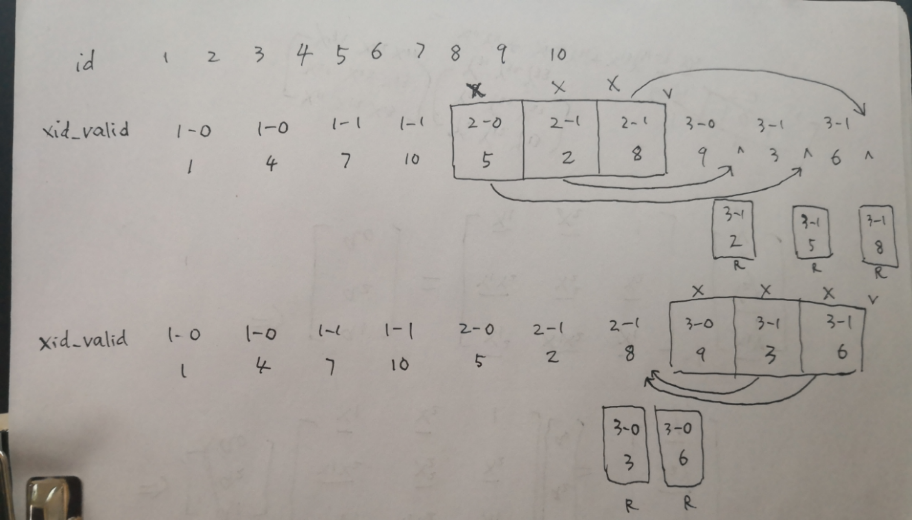

# 死锁案例一：insert-wait-lock-mode-x-insert-intention-vs-insert-wait-lock-mode-x-insert-intention-holds-lock-mode-x
===

## 1.背景

有一个业务数据表business，维护了一个名为c_id的外键，一个c_id对应多个business数据。

在业务数据新增或者修改的时候，需要同步的维护 business 的数据，这时候正确的做法是diff新旧数据，得到需要删除的一部分数据，需要新增的一部分数据以及需要更新的一部分数据，这种实现有点麻烦(其实也不麻烦，使用Guava的集合操作)，因此工程师们的通常做法是先根据c_id删除现有数据，再插入新数据。这个时候很容易出现死锁。

这里也解释一下外键，在业务DB中，出于性能考虑，通常禁止使用外键，通常的做法是，外键这种关系的维护都体现在表中手动维护一个外键。

在交代一下数据库相关的背景：

```sql
DB：Mysql 5.6
tx_isolation：REPEATABLE-READ
```

## 2.问题重现

我们在本地重现死锁信息。

建表语句已经初始化的数据如下：

```sql
CREATE TABLE `business` (
  `id` int(11) unsigned NOT NULL AUTO_INCREMENT COMMENT '',
  `c_id` int(11) NOT NULL DEFAULT '0' COMMENT '',
  `business_id` tinyint(3) unsigned NOT NULL DEFAULT '0' COMMENT '',
  PRIMARY KEY (`id`),
  UNIQUE KEY `uniq_idx_c_id_business_id` (`c_id`,`business_id`)
) ENGINE=InnoDB DEFAULT CHARSET=utf8mb4 COMMENT='';

mysql> select * from business;
+----+-------------+-------------+
| id | c_id | business_id |
+----+-------------+-------------+
| 20 |           1 |           2 |
| 21 |           1 |           3 |
| 23 |           1 |           4 |
| 22 |           1 |           5 |
| 10 |           2 |           1 |
| 11 |           2 |           2 |
|  5 |           3 |           1 |
|  6 |           4 |           1 |
|  7 |           5 |           1 |
+----+-------------+-------------+
```

我们模拟同时两个新数据的插入过程：
![[Pasted image 20230324135920.png]]

第 5 步的锁信息如下：

```sql
// 锁信息
// 事务1( 即这里的事务id：203797) 持有一个Gap锁，事务2( 即这里的事务id：203798) 持有一个Gap锁
mysql> select * from INNODB_LOCKS;
+---------------+-------------+-----------+-----------+-------------------------------+----------------------------------+------------+-----------+----------+------------------------+
| lock_id       | lock_trx_id | lock_mode | lock_type | lock_table                    | lock_index                       | lock_space | lock_page | lock_rec | lock_data              |
+---------------+-------------+-----------+-----------+-------------------------------+----------------------------------+------------+-----------+----------+------------------------+
| 203797:20:4:1 | 203797      | X         | RECORD    | `test`.`business` | uniq_idx_c_id_business_id |         20 |         4 |        1 | supremum pseudo-record |
| 203798:20:4:1 | 203798      | X         | RECORD    | `test`.`business` | uniq_idx_c_id_business_id |         20 |         4 |        1 | supremum pseudo-record |
+---------------+-------------+-----------+-----------+-------------------------------+----------------------------------+------------+-----------+----------+------------------------+

// 锁等待信息
// 事务1( 即这里的事务id：203797) 等待事务2(即这里的事务id：203798 )的锁
mysql> select * from INNODB_LOCK_WAITS;
+-------------------+-------------------+-----------------+------------------+
| requesting_trx_id | requested_lock_id | blocking_trx_id | blocking_lock_id |
+-------------------+-------------------+-----------------+------------------+
| 203797            | 203797:20:4:1     | 203798          | 203798:20:4:1    |
+-------------------+-------------------+-----------------+------------------+
```

有些人可能迷惑 lock_data 的 supremum pseudo-record 是什么东西，我们先看看 lock_data 的解释，这里面解释了 supremum pseudo-record，简单说就是正无穷。

```
Primary key value(s) of the locked record if LOCK_TYPE='RECORD', otherwise NULL. 
This column contains the value(s) of the primary key column(s) in the locked row, formatted as a valid SQL string (ready to be copied to SQL commands). 
If there is no primary key then the InnoDB internal unique row ID number is used. 
If a gap lock is taken for key values or ranges above the largest value in the index, LOCK_DATA reports “supremum pseudo-record”. 
When the page containing the locked record is not in the buffer pool (in the case that it was paged out to disk while the lock was held), InnoDB does not fetch the page from disk, to avoid unnecessary disk operations. Instead, LOCK_DATA is set to NULL.
```

死锁信息：

```
mysql> show engine innodb status \G
...
------------------------
LATEST DETECTED DEADLOCK
------------------------
2016-07-21 19:11:05 7f6b90de8700
*** (1) TRANSACTION:
TRANSACTION 203797, ACTIVE 42 sec inserting
mysql tables in use 1, locked 1
LOCK WAIT 3 lock struct(s), heap size 360, 2 row lock(s), undo log entries 1
MySQL thread id 9, OS thread handle 0x7f6b90db7700, query id 144 localhost root update
insert into business (c_id, business_id) values (6, 1)
*** (1) WAITING FOR THIS LOCK TO BE GRANTED:
RECORD LOCKS space id 20 page no 4 n bits 80 index `uniq_idx_c_id_business_id` of table `test`.`business` trx id 203797 lock_mode X insert intention waiting
Record lock, heap no 1 PHYSICAL RECORD: n_fields 1; compact format; info bits 0
 0: len 8; hex 73757072656d756d; asc supremum;;

*** (2) TRANSACTION:
TRANSACTION 203798, ACTIVE 38 sec inserting
mysql tables in use 1, locked 1
3 lock struct(s), heap size 360, 2 row lock(s), undo log entries 1
MySQL thread id 10, OS thread handle 0x7f6b90de8700, query id 147 localhost root update
insert into business (c_id, business_id) values (7, 1)
*** (2) HOLDS THE LOCK(S):
RECORD LOCKS space id 20 page no 4 n bits 80 index `uniq_idx_c_id_business_id` of table `test`.`business` trx id 203798 lock_mode X
Record lock, heap no 1 PHYSICAL RECORD: n_fields 1; compact format; info bits 0
 0: len 8; hex 73757072656d756d; asc supremum;;

*** (2) WAITING FOR THIS LOCK TO BE GRANTED:
RECORD LOCKS space id 20 page no 4 n bits 80 index `uniq_idx_c_id_business_id` of table `test`.`business` trx id 203798 lock_mode X insert intention waiting
Record lock, heap no 1 PHYSICAL RECORD: n_fields 1; compact format; info bits 0
 0: len 8; hex 73757072656d756d; asc supremum;;

*** WE ROLL BACK TRANSACTION (2)
------------
TRANSACTIONS
------------
```

从死锁信息中，我们也可以看到事务1(事务id：203797) 和 事务2(事务id：203798) 持有的锁是锁住相同的一块区域：

```
 0: len 8; hex 73757072656d756d; asc supremum;;
```

参考：[mysql InnoDB锁等待的查看及分析](http://blog.itpub.net/29819001/viewspace-1440895/)

## 3.死锁分析

有两个点需要我们知道的信息：各种SQL语句都加什么锁，为什么这里的两个delete的锁没有冲突。

#### 3.1 SQL加锁

关于各种SQL语句加什么锁，参见Mysql官方文档：[Locks Set by Different SQL Statements in InnoDB](http://dev.mysql.com/doc/refman/5.6/en/innodb-locks-set.html)

我们这里来说涉及的删除和插入，先说删除：

```
//删除，会在满足条件的记录上加一个next-key锁，也就是锁住之前的Gap和待删除的记录。
DELETE FROM ... WHERE ... sets an exclusive next-key lock on every record the search encounters.

//显然，如果删除的数据比现有最大数据max还大，就会锁(max, +∞)这个Gap
//同理，如果删除的数据比现有最小数据min还小，就会锁(-∞, min)这个Gap
```

再说插入，插入比较麻烦，因为涉及到插入意向锁(Insert Intention Lock)，还是参考Mysql官方文档：[InnoDB Locking](http://dev.mysql.com/doc/refman/5.6/en/innodb-locking.html)

```
An insert intention lock is a type of gap lock set by INSERT operations prior to row insertion. 
This lock signals the intent to insert in such a way that multiple transactions inserting into the same index gap need not wait for each other if they are not inserting at the same position within the gap. 
Suppose that there are index records with values of 4 and 7. Separate transactions that attempt to insert values of 5 and 6, respectively, each lock the gap between 4 and 7 with insert intention locks prior to obtaining the exclusive lock on the inserted row, but do not block each other because the rows are nonconflicting.
```

简单的是说，插入意向锁可以归结为如下：

```
锁的类型：Gap Lock
加锁时间：插入之前
锁的区域：待插入的区域，比如已有数据4,7，想要插入5，就会锁住(4, 7)这个区域
锁的冲突：只要两个插入的数据不在同一个位置(其实可以理解为同一个数据)，插入意向锁之间就不会冲突
```

插入的锁如下：

```
INSERT sets an exclusive lock on the inserted row. This lock is an index-record lock, not a next-key lock (that is, there is no gap lock) and does not prevent other sessions from inserting into the gap before the inserted row.

Prior to inserting the row, a type of gap lock called an insert intention gap lock is set. This lock signals the intent to insert in such a way that multiple transactions inserting into the same index gap need not wait for each other if they are not inserting at the same position within the gap. 
```

就是说插入之前会加一把插入意向锁，除此之外，会在插入的记录上加一把锁。

#### 3.2 锁冲突

关于锁冲突，我们熟知的肯定是S和S兼容，X和其他所有都不兼容。事实上并没有这么简单。比如我们这里前面的例子，两个delete都加了X型的Gap锁，应该排斥才对，但事实上是兼容的。这里参考了[从一个死锁看mysql innodb的锁机制](http://narcissusoyf.iteye.com/blog/1637309)这篇文章的结论(准备读源码验证)：

```
下面这个是 precise mode 的兼容矩阵：（这个兼容矩阵发生在X与X，S与X不兼容的情况下再进行比对的）

    G    I     R    N (已经存在的锁,包括等待的锁)
G   +     +    +     + 
I    -      +    +     -
R   +     +     -     -
N   +     +     -     -

+ 代表兼容， -代表不兼容. I代表插入意图锁,
G代表Gap锁，I代表插入意图锁,R代表记录锁，N代表Next-Key锁.
```

其实仔细读[Mysql官方文档](https://dev.mysql.com/doc/refman/5.6/en/innodb-locking.html)，我们也能发现上面的两个delete的Gap锁是兼容的：

```
Gap locks in InnoDB are “purely inhibitive”, which means they only stop other transactions from inserting to the gap. 
They do not prevent different transactions from taking gap locks on the same gap. Thus, a gap X-lock has the same effect as a gap S-lock.
```

意思就是说Gap锁的作用是只防止其他事务在这个Gap内的插入，而不排斥其他事务在同一个Gap加上Gap锁。因此Gap X锁和Gap S锁效果相同。 (真心文档每句话都需要仔细理解哈。)

## 4.解决

DBA的建议：先根据 c_id 查询id，根据 id 删除;

其实只要保证数据存在再区删除就没问题，我们假设我们执行两个以存在数据的先删除再插入。

一个辅助的示意图如下：


## 5.锁等待

其实上面的例子中会出现一个因为 UNIQUE KEY 导致的锁等待问题，我们可以重现，现有数据如下：

```
mysql> select * from business;
+----+-------------+-------------+
| id | c_id | business_id |
+----+-------------+-------------+
| 20 |           1 |           2 |
| 21 |           1 |           3 |
| 23 |           1 |           4 |
| 22 |           1 |           5 |
| 10 |           2 |           1 |
| 11 |           2 |           2 |
|  5 |           3 |           1 |
| 30 |           4 |           1 |
|  7 |           5 |           1 |
+----+-------------+-------------+
```

过程如下：

![[Pasted image 20230324140200.png]]

INNODB_LOCKS信息及INNODB_LOCK_WAITS信息如下：

```
mysql> select * from INNODB_LOCK_WAITS;
+-------------------+-------------------+-----------------+------------------+
| requesting_trx_id | requested_lock_id | blocking_trx_id | blocking_lock_id |
+-------------------+-------------------+-----------------+------------------+
| 204349            | 204349:20:4:12    | 204350          | 204350:20:4:12   |
+-------------------+-------------------+-----------------+------------------+
1 row in set (0.00 sec)

mysql> select * from INNODB_LOCKS;
+----------------+-------------+-----------+-----------+-------------------------------+----------------------------------+------------+-----------+----------+-----------+
| lock_id        | lock_trx_id | lock_mode | lock_type | lock_table                    | lock_index                       | lock_space | lock_page | lock_rec | lock_data |
+----------------+-------------+-----------+-----------+-------------------------------+----------------------------------+------------+-----------+----------+-----------+
| 204349:20:4:12 | 204349      | S         | RECORD    | `test`.`business` | uniq_idx_c_id_business_id |         20 |         4 |       12 | 4, 1      |
| 204350:20:4:12 | 204350      | X         | RECORD    | `test`.`business` | uniq_idx_c_id_business_id |         20 |         4 |       12 | 4, 1      |
+----------------+-------------+-----------+-----------+-------------------------------+----------------------------------+------------+-----------+----------+-----------+
```

show engine innodb status信息如下：

```
---TRANSACTION 204350, ACTIVE 24 sec
4 lock struct(s), heap size 1184, 3 row lock(s), undo log entries 1
MySQL thread id 22, OS thread handle 0x7fd7ee4f0700, query id 245 localhost root cleaning up
---TRANSACTION 204349, ACTIVE 31 sec inserting
mysql tables in use 1, locked 1
LOCK WAIT 5 lock struct(s), heap size 1184, 4 row lock(s), undo log entries 2
MySQL thread id 20, OS thread handle 0x7fd7ee4bf700, query id 250 localhost root update
insert into business (c_id, business_id) values (3, 1)
------- TRX HAS BEEN WAITING 6 SEC FOR THIS LOCK TO BE GRANTED:
RECORD LOCKS space id 20 page no 4 n bits 80 index `uniq_idx_c_id_business_id` of table `test`.`business` trx id 204349 lock mode S waiting
Record lock, heap no 12 PHYSICAL RECORD: n_fields 3; compact format; info bits 32
 0: len 4; hex 80000004; asc     ;;
 1: len 1; hex 01; asc  ;;
 2: len 4; hex 0000001e; asc     ;;
```

这里没明白的一点好事务1(事务id:204349)的insert一个(3, 1)的数据为什么会在(4, 1)上加一个S锁?

不过实验了一下，去掉UNIQUE KEY，使用普通的key，就没有这个锁等到问题，所以这个锁是因为UNIQUE KEY引发的。 这个问题有待进一步深入查资料。

## 参考 Reference

1. [MySQL InnoDB Deadlock For 2 simple insert queries](https://dba.stackexchange.com/questions/86878/mysql-innodb-deadlock-for-2-simple-insert-queries)
2. [Why am I getting deadlock in MySQL](https://stackoverflow.com/questions/23615641/why-am-i-getting-deadlock-in-mysql)
3. [一个线上死锁问题分析](http://mysqllover.com/?p=437)
4. https://github.com/octachrome/innodb-locks
5. [一个死锁问题](http://xiaobaoqiu.github.io/blog/2016/07/22/%5B%3F%5D-ge-si-suo-wen-ti/)

# 死锁案例二：insert-wait-lock-mode-x-insert-intention-vs-insert-wait-lock-mode-x-insert-intention-holds-lock-mode-s
===

## 死锁特征

1. insert WAITING FOR lock_mode X insert intention waiting
2. insert WAITING FOR lock_mode X insert intention waiting, HOLDS lock_mode S
3. 隔离级别：RR、RC

## 死锁日志

```log
------------------------
LATEST DETECTED DEADLOCK
------------------------
130701 20:47:57
*** (1) TRANSACTION:
TRANSACTION 4F3D6D24, ACTIVE 13 sec inserting, thread declared inside InnoDB 1
mysql tables in use 1, locked 1
LOCK WAIT 4 lock struct(s), heap size 1248, 2 row lock(s), undo log entries 1
MySQL thread id 18124702, OS thread handle 0x7fe706fdf700, query id 1435659684 localhost root update
insert into lingluo values(100214,215,215,312)
*** (1) WAITING FOR THIS LOCK TO BE GRANTED:
RECORD LOCKS space id 3351 page no 4 n bits 80 index `uk_bc` of table `test`.`lingluo` trx id 4F3D6D24 lock_mode X insert intention waiting
*** (2) TRANSACTION:
TRANSACTION 4F3D6F33, ACTIVE 11 sec inserting, thread declared inside InnoDB 1
mysql tables in use 1, locked 1
4 lock struct(s), heap size 1248, 2 row lock(s), undo log entries 1
MySQL thread id 18124715, OS thread handle 0x7fea34912700, query id 1435660081 localhost root update
insert into lingluo values(100215,215,215,312)
*** (2) HOLDS THE LOCK(S):
RECORD LOCKS space id 3351 page no 4 n bits 80 index `uk_bc` of table `test`.`lingluo` trx id 4F3D6F33 lock mode S
*** (2) WAITING FOR THIS LOCK TO BE GRANTED:
RECORD LOCKS space id 3351 page no 4 n bits 80 index `uk_bc` of table `test`.`lingluo` trx id 4F3D6F33 lock_mode X insert intention waiting
*** WE ROLL BACK TRANSACTION (2)
```

## 表结构

```sql
CREATE TABLE `lingluo` (
  `a` int(11) NOT NULL DEFAULT '0',
  `b` int(11) DEFAULT NULL,
  `c` int(11) DEFAULT NULL,
  `d` int(11) DEFAULT NULL,
  PRIMARY KEY (`a`),
  UNIQUE KEY `uk_bc` (`b`,`c`)
) ENGINE=InnoDB DEFAULT CHARSET=gbk
```

## 重现步骤

| Session 1 | Session 2 | Session 3 |
| --------- | --------- | --------- |
| insert into lingluo values(100213,215,215,312); |  |  |
|  | insert into lingluo values(100214,215,215,312); |  |
| | | insert into lingluo values(100215,215,215,312); |
| rollback; |||
|||deadlock|

## 分析

这个死锁的分析分三步：

1. 三个事务依次执行 insert 语句，由于 (b,c) 是唯一索引，所以后两个事务会出现唯一键冲突。但此时要注意的是事务一还没有提交，所以并不会立即报错。insert 语句本来加的是隐式锁，在出现唯一键冲突时，事务一的隐式锁升级为显式锁（LOCK_REC_NOT_GAP | LOCK_REC | LOCK_X），事务二和事务三为了判断是否出现唯一键冲突，必须进行一次当前读，加的锁是 Next-Key 锁，所以进入锁等待（LOCK_GAP | LOCK_REC | LOCK_S | LOCK_WAIT）。要注意的是，就算在 RC 隔离级别下，一样会加 Next-Key 锁，所以说出现 GAP 锁不一定就是 RR 隔离级别;
2. 事务一回滚，此时事务二和事务三成功获取记录上的 S 锁（LOCK_GAP | LOCK_REC | LOCK_S）；
3. 事务二和事务三继续执行插入操作，需要依次请求记录上的插入意向锁（LOCK_INSERT_INTENTION | LOCK_GAP | LOCK_X），插入意向锁和 GAP 锁冲突，所以事务二等待事务三，事务三等待事务二，形成死锁。

## 参考

1. [Bug #43210	Deadlock detected on concurrent insert into same table (InnoDB)](https://bugs.mysql.com/bug.php?id=43210)
1. [有趣的insert死锁](http://www.cnblogs.com/sunss/p/3166550.html)
1. [【MySQL】死锁案例之四](http://blog.itpub.net/22664653/viewspace-2145092/)
1. [Locks Set by Different SQL Statements in InnoDB](https://dev.mysql.com/doc/refman/5.5/en/innodb-locks-set.html)

# 死锁案例三：delete-wait-lock-mode-x-locks-rec-but-not-gap-vs-delete-wait-lock-mode-x-holds-lock-mode-x
===

## 死锁特征

1. delete WAITING FOR lock_mode X locks rec but not gap
2. delete WAITING FOR lock_mode X, HOLDS lock_mode X
3. 隔离级别：RR、RC

## 死锁日志

```
------------------------
LATEST DETECTED DEADLOCK
------------------------
*** (1) TRANSACTION:
TRANSACTION 1E7D49CDD, ACTIVE 69 sec fetching rows
mysql tables in use 1, locked 1
LOCK WAIT 4 lock struct(s), heap size 1248, 4 row lock(s), undo log entries 1
MySQL thread id 1385867, OS thread handle 0x7fcebd956700, query id 837909262 10.246.145.78 im_mobile updating
delete from offmsg_0007 WHERE target_id = 'Y25oaHVwYW7mmZbmmZblpKnkvb8=' and gmt_modified <= '2012-12-14 15:07:14'
*** (1) WAITING FOR THIS LOCK TO BE GRANTED:
RECORD LOCKS space id 203 page no 475912 n bits 88 index `PRIMARY` of table `im_mobile`.`offmsg_0007` trx id 1E7D49CDD lock_mode X locks rec but not gap waiting
*** (2) TRANSACTION:
TRANSACTION 1E7CE0399, ACTIVE 1222 sec fetching rows, thread declared inside InnoDB 272
mysql tables in use 1, locked 1
1346429 lock struct(s), heap size 119896504, 11973543 row lock(s), undo log entries 1
MySQL thread id 1090268, OS thread handle 0x7fcebf48c700, query id 837483530 10.246.145.78 im_mobile updating
delete from offmsg_0007 WHERE target_id = 'Y25oaHVwYW7niLHkuZ3kuYU5OQ==' and gmt_modified <= '2012-12-14 14:13:28'
*** (2) HOLDS THE LOCK(S):
RECORD LOCKS space id 203 page no 475912 n bits 88 index `PRIMARY` of table `im_mobile`.`offmsg_0007` trx id 1E7CE0399 lock_mode X
*** (2) WAITING FOR THIS LOCK TO BE GRANTED:
RECORD LOCKS space id 203 page no 1611099 n bits 88 index `PRIMARY` of table `im_mobile`.`offmsg_0007` trx id 1E7CE0399 lock_mode X waiting
```

## 表结构

```sql
CREATE TABLE `msg` (
  `id` bigint(20) NOT NULL AUTO_INCREMENT,
  `target_id` varchar(100) COLLATE utf8_bin NOT NULL ,
  `flag` tinyint(4) NOT NULL ,
  `gmt_create` datetime NOT NULL,
  `gmt_modified` datetime NOT NULL,
  `datablob` blob,
  `nickname` varchar(64) COLLATE utf8_bin DEFAULT NULL ,
  `source` tinyint(4) DEFAULT NULL ,
  PRIMARY KEY (`id`),
  KEY `idx_o_tid` (`target_id`,`gmt_modified`,`source`,`flag`)
) ENGINE=InnoDB
```

## 重现步骤

| Session 1 | Session 2 |
| --------- | --------- |
| delete from offmsg_0007 WHERE target_id = 'Y25oaHVwYW7niLHkuZ3kuYU5OQ\==' and gmt_modified <= '2012-12-14 14:13:28' | delete from offmsg_0007 WHERE target_id = 'Y25oaHVwYW7mmZbmmZblpKnkvb8=' and gmt_modified <= '2012-12-14 15:07:14' |

## 分析

从死锁日志里可以看出事务二已经持有了 page no 475912 主键上的 next-key 锁，并想要继续获取 page no 1611099 主键上的 next-key 锁，并且这个事务状态为 `fetching rows`，可以推测出事务二正在走主键扫描。而事务一要获取的锁为主键上的记录锁（lock_mode X locks rec but not gap），这是 delete 语句走二级索引正常情况下的加锁模式。

那么为什么事务二没有走二级索引？原因很可能是事务二的 WHERE 条件匹配的数据行太多，这种情况 MySQL 的优化器会认为走二级索引回表效率低，还不如直接走主键全表扫描。

虽然两个 delete 语句很类似，但是由于走不同索引，对主键索引的加锁顺序的不一致将导致死锁。

## 参考

1. [[MySQL 学习] Innodb锁系统(1)之如何阅读死锁日志](http://mysqllover.com/?p=411)
2. [[MySQL 学习] Innodb锁系统（2）关键函数路径](http://mysqllover.com/?p=416)
3. [[MySQL学习] Innodb锁系统(3)关键结构体及函数](http://mysqllover.com/?p=425)
4. [[MySQL学习] Innodb锁系统(4) Insert/Delete 锁处理及死锁示例分析](http://mysqllover.com/?p=431)

# 死锁案例四：delete-wait-lock-mode-x-vs-insert-wait-lock-mode-s-holds-lock-mode-x-locks-rec-but-not-gap
===

## 死锁特征

1. delete WAITING FOR lock_mode X
2. insert WAITING FOR lock mode S, HOLDS lock_mode X locks rec but not gap
3. 隔离级别：RR

## 死锁日志

```
------------------------
LATEST DETECTED DEADLOCK
------------------------
170219 13:31:31
*** (1) TRANSACTION:
TRANSACTION 2A8BD, ACTIVE 11 sec starting index read
mysql tables in use 1, locked 1
LOCK WAIT 2 lock struct(s), heap size 376, 1 row lock(s)
MySQL thread id 448218, OS thread handle 0x2abe5fb5d700, query id 18923238 renjun.fangcloud.net 121.41.41.92 root updating
delete from test where a = 2
*** (1) WAITING FOR THIS LOCK TO BE GRANTED:
RECORD LOCKS space id 0 page no 923 n bits 80 index `a` of table `oauthdemo`.`test` trx id 2A8BD lock_mode X waiting
Record lock, heap no 3 PHYSICAL RECORD: n_fields 2; compact format; info bits 32
 0: len 4; hex 00000002; asc     ;;
 1: len 4; hex 00000002; asc     ;;
*** (2) TRANSACTION:
TRANSACTION 2A8BC, ACTIVE 18 sec inserting
mysql tables in use 1, locked 1
4 lock struct(s), heap size 1248, 3 row lock(s), undo log entries 2
MySQL thread id 448217, OS thread handle 0x2abe5fd65700, query id 18923239 renjun.fangcloud.net 121.41.41.92 root update
insert into test (id,a) values (10,2)
*** (2) HOLDS THE LOCK(S):
RECORD LOCKS space id 0 page no 923 n bits 80 index `a` of table `oauthdemo`.`test` trx id 2A8BC lock_mode X locks rec but not gap
Record lock, heap no 3 PHYSICAL RECORD: n_fields 2; compact format; info bits 32
 0: len 4; hex 00000002; asc     ;;
 1: len 4; hex 00000002; asc     ;;
*** (2) WAITING FOR THIS LOCK TO BE GRANTED:
RECORD LOCKS space id 0 page no 923 n bits 80 index `a` of table `oauthdemo`.`test` trx id 2A8BC lock mode S waiting
Record lock, heap no 3 PHYSICAL RECORD: n_fields 2; compact format; info bits 32
 0: len 4; hex 00000002; asc     ;;
 1: len 4; hex 00000002; asc     ;;
*** WE ROLL BACK TRANSACTION (1)
```

## 表结构

```sql
CREATE TABLE `test` (
  `id` int(11) unsigned NOT NULL AUTO_INCREMENT,
  `a` int(11) unsigned DEFAULT NULL,
  PRIMARY KEY (`id`),
  UNIQUE KEY `a` (`a`)
) ENGINE=InnoDB DEFAULT CHARSET=utf8;
```

初始数据：

```
insert into test(id, a) values(1,1),(2,2),(3,3),(4,4),(5,5),(6,6),(7,7),(8,8);
```

## 重现步骤

| Session 1 | Session 2 |
| --------- | --------- |
||delete from test where a = 2;|
|delete from test where a = 2; ||
||insert into test (id, a) values (10, 2);|

## 分析

delete 语句正常情况下会对存在的记录加记录锁（lock_mode X locks rec but not gap），但是事务一的 delete 语句却在加 next-key 锁（lock_mode X），只有当这条记录已经被标记为删除时才会出现这种情况，我们从 `info bits 32` 也可以看出来这条记录已经被标记为删除了。

再从事务二的 `undo log entries 2` 可以推测在执行 insert 之前还执行了至少一条语句，从它 HOLDS 的锁是 lock_mode X locks rec but not gap，并且 page no 也是 923，大致可以猜出事务二先执行了 delete 语句。

另外，事务二正在执行 insert 语句，并尝试获取 lock mode S waiting 锁，这是为了检测唯一键是否重复，必须进行一次当前读，要加 S 锁。要注意的是，这里的 S 锁是 lock mode S，而不是 lock_mode S locks rec but not gap，，也就是说检测唯一键加的是 Next-Key 锁，而不是记录锁。

## 参考

1. [记录一次Mysql死锁排查过程](http://www.kissyu.org/2017/02/19/%E8%AE%B0%E5%BD%95%E4%B8%80%E6%AC%A1Mysql%E6%AD%BB%E9%94%81%E6%8E%92%E6%9F%A5%E8%BF%87%E7%A8%8B/)
1. [MySQL · 引擎特性 · InnoDB 事务锁系统简介](http://mysql.taobao.org/monthly/2016/01/01/)

# 死锁案例五：delete-wait-lock-mode-x-vs-insert-wait-lock-mode-x-locks-gap-before-rec-insert-intention-holds-lock-mode-x-locks-rec-but-not-gap
===

## 死锁特征

1. delete WAITING FOR lock_mode X
2. insert WAITING FOR lock_mode X locks gap before rec insert intention, HOLDS lock_mode X locks rec but not gap
3. 隔离级别：RR

## 死锁日志

```
------------------------
LATEST DETECTED DEADLOCK
------------------------
170219 13:31:31
*** (1) TRANSACTION:
TRANSACTION 2A8BD, ACTIVE 11 sec starting index read
mysql tables in use 1, locked 1
LOCK WAIT 2 lock struct(s), heap size 376, 1 row lock(s)
MySQL thread id 448218, OS thread handle 0x2abe5fb5d700, query id 18923238 renjun.fangcloud.net 121.41.41.92 root updating
delete from test where a = 2
*** (1) WAITING FOR THIS LOCK TO BE GRANTED:
RECORD LOCKS space id 0 page no 923 n bits 80 index `a` of table `oauthdemo`.`test` trx id 2A8BD lock_mode X waiting
Record lock, heap no 3 PHYSICAL RECORD: n_fields 2; compact format; info bits 32
 0: len 4; hex 00000002; asc     ;;
 1: len 4; hex 00000002; asc     ;;
*** (2) TRANSACTION:
TRANSACTION 2A8BC, ACTIVE 18 sec inserting
mysql tables in use 1, locked 1
4 lock struct(s), heap size 1248, 3 row lock(s), undo log entries 2
MySQL thread id 448217, OS thread handle 0x2abe5fd65700, query id 18923239 renjun.fangcloud.net 121.41.41.92 root update
insert into test (id,a) values (10,2)
*** (2) HOLDS THE LOCK(S):
RECORD LOCKS space id 0 page no 923 n bits 80 index `a` of table `oauthdemo`.`test` trx id 2A8BC lock_mode X locks rec but not gap
Record lock, heap no 3 PHYSICAL RECORD: n_fields 2; compact format; info bits 32
 0: len 4; hex 00000002; asc     ;;
 1: len 4; hex 00000002; asc     ;;
*** (2) WAITING FOR THIS LOCK TO BE GRANTED:
RECORD LOCKS space id 0 page no 923 n bits 80 index `a` of table `oauthdemo`.`test` trx id 2A8BC lock_mode X locks gap before rec insert intention waiting
Record lock, heap no 3 PHYSICAL RECORD: n_fields 2; compact format; info bits 32
 0: len 4; hex 00000002; asc     ;;
 1: len 4; hex 00000002; asc     ;;
*** WE ROLL BACK TRANSACTION (1)
```

## 表结构

```sql
CREATE TABLE `test` (
  `id` int(11) unsigned NOT NULL AUTO_INCREMENT,
  `a` int(11) unsigned DEFAULT NULL,
  PRIMARY KEY (`id`),
  UNIQUE KEY `a` (`a`)
) ENGINE=InnoDB DEFAULT CHARSET=utf8;
```

## 重现步骤

| Session 1 | Session 2 |
| --------- | --------- |
||delete from test where a = 2;|
||insert into test (id, a) values (10, 2); insert第1阶段：事务2申请S锁进行duplicate key进行检查。检查成功。|
|delete from test where a = 2; ||
||insert into test (id, a) values (10, 2); insert第2阶段：事务2开始插入数据，S锁升级为X锁，类型为insert intention。同理，X锁进入队列排队，形成循环等待，死锁产生。|

## 分析

这个场景和 [delete-wait-lock-mode-x-vs-insert-wait-lock-mode-s-holds-lock-mode-x-locks-rec-but-not-gap](4.md) 一模一样，但是没办法手动重现，只能在高并发情况下可能会出现。

这个死锁的原因在于 insert 加锁分几个阶段：先检查唯一键约束，加 S 锁，再加插入意向锁，最后插入成功时升级为 X 锁。

[delete-wait-lock-mode-x-vs-insert-wait-lock-mode-s-holds-lock-mode-x-locks-rec-but-not-gap](4.md) 中，insert 加 S 锁时冲突导致死锁，而这里是加插入意向锁时冲突导致死锁。

## 参考

1. [记录一次Mysql死锁排查过程](http://www.kissyu.org/2017/02/19/%E8%AE%B0%E5%BD%95%E4%B8%80%E6%AC%A1Mysql%E6%AD%BB%E9%94%81%E6%8E%92%E6%9F%A5%E8%BF%87%E7%A8%8B/)


# 死锁案例六：delete-wait-lock-mode-x-vs-delete-wait-lock-mode-x-holds-lock-mode-x-locks-rec-but-not-gap
===

## 死锁特征

1. delete WAITING FOR lock_mode X
2. delete WAITING FOR lock mode X, HOLDS lock_mode X locks rec but not gap
3. 隔离级别：RR

## 死锁日志

```
------------------------
LATEST DETECTED DEADLOCK
------------------------
140122 18:11:58
*** (1) TRANSACTION:
TRANSACTION 930F9, ACTIVE 0 sec starting index read
mysql tables in use 1, locked 1
LOCK WAIT 2 lock struct(s), heap size 376, 1 row lock(s)
MySQL thread id 2096, OS thread handle 0x7f3570976700, query id 1485879 localhost 127.0.0.1 rj updating
delete from dltask where a = 'b' and b = 'b' and c = 'a'
*** (1) WAITING FOR THIS LOCK TO BE GRANTED:
RECORD LOCKS space id 0 page no 12713 n bits 96 index `uniq_a_b_c` of table `dltst`.`dltask` trx id 930F9 lock_mode X waiting
*** (2) TRANSACTION:
TRANSACTION 930F3, ACTIVE 0 sec starting index read
mysql tables in use 1, locked 1
3 lock struct(s), heap size 376, 2 row lock(s)
MySQL thread id 2101, OS thread handle 0x7f3573d88700, query id 1485872 localhost 127.0.0.1 rj updating
delete from dltask where a = 'b' and b = 'b' and c = 'a'
*** (2) HOLDS THE LOCK(S):
RECORD LOCKS space id 0 page no 12713 n bits 96 index `uniq_a_b_c` of table `dltst`.`dltask` trx id 930F3 lock_mode X locks rec but not gap
*** (2) WAITING FOR THIS LOCK TO BE GRANTED:
RECORD LOCKS space id 0 page no 12713 n bits 80 index `uniq_a_b_c` of table `dltst`.`dltask` trx id 930F3 lock mode X waiting
*** WE ROLL BACK TRANSACTION (1)
```

## 表结构

```sql
CREATE TABLE dltask (
  id bigint unsigned NOT NULL AUTO_INCREMENT COMMENT ‘auto id’,
  a varchar(30) NOT NULL COMMENT ‘uniq.a’,
  b varchar(30) NOT NULL COMMENT ‘uniq.b’,
  c varchar(30) NOT NULL COMMENT ‘uniq.c’,
  x varchar(30) NOT NULL COMMENT ‘data’,
  PRIMARY KEY (id),
  UNIQUE KEY uniq_a_b_c (a, b, c)
) ENGINE=InnoDB DEFAULT CHARSET=utf8 COMMENT=’deadlock test’;
```

## 重现步骤

| Session 1 | Session 2 | Session 3 |
| --------- | --------- | --------- |
|delete from dltask where a=’a’ and b=’b’ and c=’c’;|delete from dltask where a=’a’ and b=’b’ and c=’c’;|delete from dltask where a=’a’ and b=’b’ and c=’c’;|

## 分析

delete 语句的加锁有三种情况：
1. 记录存在且有效：加记录X锁（lock_mode X locks rec but not gap）；
2. 记录存在但无效（被标记为删除）：加 Next-key 锁（lock_mode X）；
3. 记录不存在：加 gap 锁（locks gap before rec）；

从事务二 HOLDS THE LOCK `lock_mode X locks rec but not gap` 可以看出事务二已经成功删除了这条记录，并且给这条记录打上了删除标记，所以事务一在删除的时候 WAIT 的锁是 Next-key 锁（lock_mode X）。但是，为什么事务二都已经成功删除了记录，却还要等待 Next-key 锁呢？

其实这个地方我们有点先入为主了，持有记录锁（locks rec but not gap）的事务不一定就是成功删除记录的事务，因为从获取记录锁到把记录标记为删除，这中间还有一个时间间隙，所以在大并发下，可能会出现两个事务同时争取记录锁。

| Session 1 | Session 2 |
| --------- | --------- |
|获取记录锁（locks rec but not gap）||
||获取记录锁（locks rec but not gap），和事务一冲突，等待|
|将记录标记为删除，并提交事务||
||记录锁获取成功|

这个时候虽然事务二也获取了记录锁，但是这条记录已经发生了变动，MySQL 会重新对该记录加锁，但是原来加的记录锁并不会释放，如果此时再有一个事务发起 delete 操作，就有可能发生死锁。

| Session 2 | Session 3 |
| --------- | --------- |
|记录变动，需重新加锁，但记录锁保持不变||
||发起删除操作，由于记录标记为删除，所以获取 Next-key 锁，和事务二的记录锁冲突|
|重新加锁时获取 Next-key 锁，和事务三冲突，发生死锁 |.|

关于这个死锁，还有另一个形式：[delete-wait-lock-mode-x-locks-rec-but-not-gap-vs-delete-wait-lock-mode-x-holds-lock-mode-x-locks-rec-but-not-gap](7.md)

更多的分析可以阅读后面的参考链接。

## 参考

1. [一个最不可思议的MySQL死锁分析](http://hedengcheng.com/?p=844)
2. http://hedengcheng.com/?p=771#comment-5549

# 死锁案例七：delete-wait-lock-mode-x-locks-rec-but-not-gap-vs-delete-wait-lock-mode-x-holds-lock-mode-x-locks-rec-but-not-gap
===

## 死锁特征

1. delete WAITING FOR lock_mode X locks rec but not gap
2. delete WAITING FOR lock mode X, HOLDS lock_mode X locks rec but not gap
3. 隔离级别：RR

## 死锁日志

```
------------------------
LATEST DETECTED DEADLOCK
------------------------
2014-01-22 20:48:08 7f4248516700
*** (1) TRANSACTION:
TRANSACTION 2268, ACTIVE 0 sec starting index read
mysql tables in use 1, locked 1
LOCK WAIT 2 lock struct(s), heap size 376, 1 row lock(s)
MySQL thread id 11, OS thread handle 0x7f4248494700, query id 1207 localhost 127.0.0.1 rj updating
*** (1) WAITING FOR THIS LOCK TO BE GRANTED:
RECORD LOCKS space id 6 page no 4 n bits 96 index `uniq_a_b_c` of table `dltst`.`dltask` trx id 2268 lock_mode X locks rec but not gap waiting
*** (2) TRANSACTION:
TRANSACTION 2271, ACTIVE 0 sec starting index read
mysql tables in use 1, locked 1
3 lock struct(s), heap size 376, 2 row lock(s)
MySQL thread id 9, OS thread handle 0x7f4248516700, query id 1208 localhost 127.0.0.1 rj updating
delete from dltask where a=’b’ and b=’a’ and c=’c’
*** (2) HOLDS THE LOCK(S):
RECORD LOCKS space id 6 page no 4 n bits 96 index `uniq_a_b_c` of table `dltst`.`dltask` trx id 2271 lock_mode X locks rec but not gap
*** (2) WAITING FOR THIS LOCK TO BE GRANTED:
RECORD LOCKS space id 6 page no 4 n bits 96 index `uniq_a_b_c` of table `dltst`.`dltask` trx id 2271 lock_mode X waiting
*** WE ROLL BACK TRANSACTION (1)
```

## 表结构

```sql
CREATE TABLE dltask (
  id bigint unsigned NOT NULL AUTO_INCREMENT COMMENT ‘auto id’,
  a varchar(30) NOT NULL COMMENT ‘uniq.a’,
  b varchar(30) NOT NULL COMMENT ‘uniq.b’,
  c varchar(30) NOT NULL COMMENT ‘uniq.c’,
  x varchar(30) NOT NULL COMMENT ‘data’,
  PRIMARY KEY (id),
  UNIQUE KEY uniq_a_b_c (a, b, c)
) ENGINE=InnoDB DEFAULT CHARSET=utf8 COMMENT=’deadlock test’;
```

## 重现步骤

| Session 1 | Session 2 | Session 3 | Session 4 |
| --------- | --------- | --------- | --------- |
|delete from dltask where a=’a’ and b=’b’ and c=’c’;|delete from dltask where a=’a’ and b=’b’ and c=’c’;|delete from dltask where a=’a’ and b=’b’ and c=’c’;|delete from dltask where a=’a’ and b=’b’ and c=’c’;|

## 分析

这个死锁和 [delete-wait-lock-mode-x-vs-delete-wait-lock-mode-x-holds-lock-mode-x-locks-rec-but-not-gap](6.md) 场景是一样的，只是稍微要复杂一点。我推测的结果如下（不一定正确，如有不足，欢迎斧正）：

| Session 1 | Session 2 | Session 3 | Session 4 |
| --------- | --------- | --------- | --------- |
|获取记录锁（locks rec but not gap）||||
||获取记录锁（locks rec but not gap），和事务一冲突，等待|||
|||获取记录锁（locks rec but not gap），和事务二冲突，等待||
|将记录标记为删除，并提交事务||||
||记录锁获取成功|||
||记录变动，需重新加锁，但记录锁保持不变|||
||||发起删除操作，由于记录标记为删除，所以获取 Next-key 锁，和事务三的记录锁冲突|
||重新加锁时获取 Next-key 锁，和事务四冲突，发生死锁 ||.|

至此，事务三等待事务二，事务四等待事务三，事务二等待事务四，三个事务相互等待导致死锁。

注意死锁日志中只会显示两个事务，在遇到多个事务导致死锁时就不好分析。

## 参考

1. [一个最不可思议的MySQL死锁分析](http://hedengcheng.com/?p=844)
2. http://hedengcheng.com/?p=771#comment-5549


# 死锁案例八：delete-wait-lock-mode-x-locks-rec-but-not-gap-vs-delete-wait-lock-mode-x-locks-rec-but-not-gap-holds-lock-mode-x-locks-rec-but-not-gap
===

## 死锁特征

1. delete WAITING FOR lock_mode X locks rec but not gap
2. delete WAITING FOR lock_mode X locks rec but not gap, HOLDS lock_mode X locks rec but not gap

## 死锁日志

```
------------------------
LATEST DETECTED DEADLOCK
------------------------
2018-04-03 13:22:29 0xbd0
*** (1) TRANSACTION:
TRANSACTION 245852, ACTIVE 0 sec starting index read
mysql tables in use 1, locked 1
LOCK WAIT 3 lock struct(s), heap size 1136, 2 row lock(s), undo log entries 1
MySQL thread id 91, OS thread handle 6964, query id 366044 localhost ::1 root updating
delete from t where id = 2
*** (1) WAITING FOR THIS LOCK TO BE GRANTED:
RECORD LOCKS space id 87 page no 3 n bits 72 index PRIMARY of table `sys`.`t` trx id 245852 lock_mode X locks rec but not gap waiting
Record lock, heap no 3 PHYSICAL RECORD: n_fields 6; compact format; info bits 32
 0: len 4; hex 80000002; asc     ;;
 1: len 6; hex 00000003c05d; asc      ];;
 2: len 7; hex 70000001850bf6; asc p      ;;
 3: len 4; hex 80000004; asc     ;;
 4: len 4; hex 80000005; asc     ;;
 5: len 4; hex 80000006; asc     ;;

*** (2) TRANSACTION:
TRANSACTION 245853, ACTIVE 0 sec starting index read, thread declared inside InnoDB 5000
mysql tables in use 1, locked 1
3 lock struct(s), heap size 1136, 2 row lock(s), undo log entries 1
MySQL thread id 93, OS thread handle 3024, query id 366045 localhost ::1 root updating
delete from t where id = 1
*** (2) HOLDS THE LOCK(S):
RECORD LOCKS space id 87 page no 3 n bits 72 index PRIMARY of table `sys`.`t` trx id 245853 lock_mode X locks rec but not gap
Record lock, heap no 3 PHYSICAL RECORD: n_fields 6; compact format; info bits 32
 0: len 4; hex 80000002; asc     ;;
 1: len 6; hex 00000003c05d; asc      ];;
 2: len 7; hex 70000001850bf6; asc p      ;;
 3: len 4; hex 80000004; asc     ;;
 4: len 4; hex 80000005; asc     ;;
 5: len 4; hex 80000006; asc     ;;

*** (2) WAITING FOR THIS LOCK TO BE GRANTED:
RECORD LOCKS space id 87 page no 3 n bits 72 index PRIMARY of table `sys`.`t` trx id 245853 lock_mode X locks rec but not gap waiting
Record lock, heap no 2 PHYSICAL RECORD: n_fields 6; compact format; info bits 32
 0: len 4; hex 80000001; asc     ;;
 1: len 6; hex 00000003c05c; asc      \;;
 2: len 7; hex 6f0000015a1a7e; asc o   Z ~;;
 3: len 4; hex 80000001; asc     ;;
 4: len 4; hex 80000002; asc     ;;
 5: len 4; hex 80000003; asc     ;;

*** WE ROLL BACK TRANSACTION (2)
```

## 表结构

```sql
CREATE TABLE `t` (
  `id` INT(11) NOT NULL AUTO_INCREMENT,
  `a` INT(11) DEFAULT NULL,
  PRIMARY KEY (`id`)
) ENGINE=INNODB
```

## 重现步骤

| Session 1 | Session 2 |
| --------- | --------- |
|delete from t where id = 1||
||delete from t where id = 2|
|delete from t where id = 2||
||delete from t where id = 1|

也可以通过下面的 mysqlslap 命令模拟死锁场景：

```
mysqlslap --create-schema sys -q "begin; delete from t where id = 1; delete from t where id = 2; rollback;" --number-of-queries=100000  -uroot -p
mysqlslap --create-schema sys -q "begin; delete from t where id = 2; delete from t where id = 1; rollback;" --number-of-queries=100000  -uroot -p
```

## 分析

死锁的根本原因是有两个或多个事务之间加锁顺序的不一致导致的，这个死锁案例其实是最经典的死锁场景。

首先，事务一获取 id = 1 的锁，事务二获取 id = 2 的锁；然后，事务一试图获取 id = 2 的锁，事务二试图获取 id = 1 的锁，相互等待导致死锁。

这个死锁并不难理解，不过根据这个死锁日志倒推出死锁场景却并不容易，因为有些死锁场景和这个几乎一模一样，譬如 [delete-wait-lock-mode-x-locks-rec-but-not-gap-vs-delete-wait-lock-mode-x-locks-rec-but-not-gap-holds-lock-mode-x-locks-rec-but-not-gap](9.md)，而且这种死锁很可能是三个或三个以上的事务导致的，譬如下面这样：

| Session 1 | Session 2 | Session 3 |
| --------- | --------- | --------- |
|delete from t where id = 1|delete from t where id = 2|delete from t where id = 3|
||delete from t where id = 1||
|||delete from t where id = 2|
|delete from t where id = 3|||

这种场景的死锁日志和上述两个事务的死锁日志没有任何区别，所以具体情况还需要具体分析。

如果事务执行的两个 SQL 语句不属于同一个表，死锁情形是一样的，参考[1]。

## 参考

1. [MySQL死锁案例分析（一）](http://www.fordba.com/mysql_dead_lock_1st.html)


# 死锁案例九：delete-wait-lock-mode-x-locks-rec-but-not-gap-vs-delete-wait-lock-mode-x-locks-rec-but-not-gap-holds-lock-mode-x-locks-rec-but-not-gap
===

## 死锁特征

1. delete WAITING FOR lock_mode X locks rec but not gap
2. delete WAITING FOR lock_mode X locks rec but not gap, HOLDS lock_mode X locks rec but not gap

## 死锁日志

```
------------------------
LATEST DETECTED DEADLOCK
------------------------
2018-04-03 09:50:13 0x2bec
*** (1) TRANSACTION:
TRANSACTION 239662, ACTIVE 0 sec starting index read
mysql tables in use 1, locked 1
LOCK WAIT 3 lock struct(s), heap size 1136, 2 row lock(s)
MySQL thread id 87, OS thread handle 7632, query id 356196 localhost ::1 root updating
delete from t where a = 4
*** (1) WAITING FOR THIS LOCK TO BE GRANTED:
RECORD LOCKS space id 87 page no 3 n bits 72 index PRIMARY of table `sys`.`t` trx id 239662 lock_mode X locks rec but not gap waiting
Record lock, heap no 3 PHYSICAL RECORD: n_fields 6; compact format; info bits 32
 0: len 4; hex 80000002; asc     ;;
 1: len 6; hex 00000003a82d; asc      -;;
 2: len 7; hex 57000001a82e44; asc W    .D;;
 3: len 4; hex 80000004; asc     ;;
 4: len 4; hex 80000005; asc     ;;
 5: len 4; hex 80000006; asc     ;;

*** (2) TRANSACTION:
TRANSACTION 239661, ACTIVE 0 sec updating or deleting, thread declared inside InnoDB 4999
mysql tables in use 1, locked 1
4 lock struct(s), heap size 1136, 3 row lock(s), undo log entries 1
MySQL thread id 89, OS thread handle 11244, query id 356194 localhost ::1 root updating
delete from t where b = 5
*** (2) HOLDS THE LOCK(S):
RECORD LOCKS space id 87 page no 3 n bits 72 index PRIMARY of table `sys`.`t` trx id 239661 lock_mode X locks rec but not gap
Record lock, heap no 3 PHYSICAL RECORD: n_fields 6; compact format; info bits 32
 0: len 4; hex 80000002; asc     ;;
 1: len 6; hex 00000003a82d; asc      -;;
 2: len 7; hex 57000001a82e44; asc W    .D;;
 3: len 4; hex 80000004; asc     ;;
 4: len 4; hex 80000005; asc     ;;
 5: len 4; hex 80000006; asc     ;;

*** (2) WAITING FOR THIS LOCK TO BE GRANTED:
RECORD LOCKS space id 87 page no 4 n bits 72 index idx_a_b of table `sys`.`t` trx id 239661 lock_mode X locks rec but not gap waiting
Record lock, heap no 3 PHYSICAL RECORD: n_fields 3; compact format; info bits 0
 0: len 4; hex 80000004; asc     ;;
 1: len 4; hex 80000005; asc     ;;
 2: len 4; hex 80000002; asc     ;;

*** WE ROLL BACK TRANSACTION (1)
```

## 表结构

```sql
CREATE TABLE `t` (
  `id` INT(11) NOT NULL AUTO_INCREMENT,
  `a` INT(11) DEFAULT NULL,
  `b` INT(11) DEFAULT NULL,
  `c` INT(11) DEFAULT NULL,
  PRIMARY KEY (`id`),
  KEY `idx_a_b` (`a`,`b`),
  KEY `idx_b` (`b`)
) ENGINE=INNODB
```

## 重现步骤

| Session 1 | Session 2 |
| --------- | --------- |
|delete from t where a = 4|delete from t where b = 5|

也可以通过下面的 mysqlslap 命令模拟死锁场景：

```
mysqlslap --create-schema sys -q "begin; delete from t where a = 4; rollback;" --number-of-queries=100000  -uroot -p
mysqlslap --create-schema sys -q "begin; delete from t where b = 5; rollback;" --number-of-queries=100000  -uroot -p
```

## 分析

这个死锁现象和 [delete-wait-lock-mode-x-locks-rec-but-not-gap-vs-delete-wait-lock-mode-x-locks-rec-but-not-gap-holds-lock-mode-x-locks-rec-but-not-gap](8.md) 几乎是一模一样的，区别在于锁的索引不一样，前者正在等待索引 idx_a_b 上的锁，而后者正在等待 PRIMARY 上的锁。

这个其实也是典型的由于两个事务之间加锁顺序不一致导致的死锁场景，虽然两个事务都只有一条 SQL 语句，但是这两条语句加锁的顺序是有区别的，如下：

事务一 `delete from t where a = 4` 走 idx_a_b 索引，首先会对 a = 4 对应的 idx_a_b 二级索引加锁，然后对主键索引 id = 2 加锁，最后会给 a = 4 对应的 idx_b 二级索引加锁；事务二 `delete from t where b = 5` 走的是 idx_b 索引，首先对 b = 5 对应的 idx_b 二级索引加锁，然后对主键索引 id = 2 加锁，最后会给 b = 5 对应的 idx_a_b 二级索引加锁，如下：

| Session 1 | Session 2 |
| --------- | --------- |
||对 idx_b 索引 b = 5 加锁|
||对主键 id = 2 加锁|
|对 idx_a_b 索引 a = 4 加锁||
|对主键 id = 2 加锁，等待||
||对 idx_a_b 索引 a = 4 加锁，等待，死锁|

这里的例子是 delete 语句，通过二级索引删除记录的加锁顺序为：二级索引（WHERE使用到二级索引）–> 主键索引 –> 所有其它二级索引；如果是 update 语句，加锁顺序也类似，通过二级索引更新记录的加锁顺序为：二级索引（WHERE条件使用二级索引）–> 主键索引 –> 包含更新字段的其它二级索引。

## 参考

1. [InnoDB inplace-update加锁流程分析](http://www.gpfeng.com/?p=406)

# 死锁案例十：delete-wait-lock-mode-x-vs-insert-wait-lock-mode-x-locks-gap-before-rec-insert-intention-holds-lock-mode-s
===

## 死锁特征

1. delete WAITING FOR lock_mode X
2. insert WAITING FOR lock_mode X locks gap before rec insert intention, HOLDS lock_mode S

## 死锁日志

```
------------------------
LATEST DETECTED DEADLOCK
------------------------
141009 12:54:59
*** (1) TRANSACTION:
TRANSACTION AEE50DCB, ACTIVE 0 sec starting index read
mysql tables in use 1, locked 1
LOCK WAIT 2 lock struct(s), heap size 376, 1 row lock(s)
MySQL thread id 6055694, OS thread handle 0x7f4345c8d700, query id 2443700084 192.168.249.154 crm_w updating
DELETE FROM crm_business WHERE serial_number = 'CH01313320'
*** (1) WAITING FOR THIS LOCK TO BE GRANTED:
RECORD LOCKS space id 244 page no 817 n bits 824 index `uniq_serial_number_business_type` of table `crm`.`crm_business` trx id AEE50DCB lock_mode X waiting
*** (2) TRANSACTION:
TRANSACTION AEE50DCA, ACTIVE 0 sec inserting, thread declared inside InnoDB 500
mysql tables in use 1, locked 1
3 lock struct(s), heap size 1248, 3 row lock(s), undo log entries 1
MySQL thread id 6055696, OS thread handle 0x7f4344941700, query id 2443700084 192.168.249.154 crm_w update
INSERT INTO crm_business(serial_number, business_type) values ('CH01313318', 2)
*** (2) HOLDS THE LOCK(S):
RECORD LOCKS space id 244 page no 817 n bits 824 index `uniq_serial_number_business_type` of table `crm`.`crm_business` trx id AEE50DCA lock mode S
*** (2) WAITING FOR THIS LOCK TO BE GRANTED:
RECORD LOCKS space id 244 page no 817 n bits 824 index `uniq_serial_number_business_type` of table `crm`.`crm_business` trx id AEE50DCA lock_mode X locks gap before rec insert intention waiting
*** WE ROLL BACK TRANSACTION (1)
```

# 表结构

```sql
CREATE TABLE `crm_business` (
  `id` int(11) unsigned NOT NULL AUTO_INCREMENT COMMENT '主键ID',
  `serial_number` varchar(50) NOT NULL COMMENT '商户编号',
  `business_type` tinyint(1) NOT NULL COMMENT '业务类型',
  PRIMARY KEY (`id`),
  UNIQUE KEY `uniq_serial_number_business_type` (`serial_number`,`business_type`)
) ENGINE=InnoDB DEFAULT CHARSET=utf8 COMMENT='合作业务'
```

## 重现步骤

| Session 1 | Session 2 |
| --------- | --------- |
|DELETE FROM crm_business WHERE serial_number = 'CH01313320'|INSERT INTO crm_business(serial_number, business_type) values ('CH01313318', 2)|

## 分析

这又是一个单语句导致死锁的案例，具体的分析还是要将 insert 语句的加锁过程进行拆解，和 [delete-wait-lock-mode-x-vs-insert-wait-lock-mode-x-locks-gap-before-rec-insert-intention-holds-lock-mode-x-locks-rec-but-not-gap](5.md) 一样。

分析如下：

| Session 1 | Session 2 |
| --------- | --------- |
||INSERT INTO crm_business(serial_number, business_type) values ('CH01313318', 2); insert第1阶段：事务2申请S锁进行duplicate key进行检查。检查成功。|
|DELETE FROM crm_business WHERE serial_number = 'CH01313320'; 对索引加 X 锁，和 S 锁冲突，等待||
||INSERT INTO crm_business(serial_number, business_type) values ('CH01313318', 2); insert第2阶段：事务2开始插入数据，S锁升级为X锁，类型为insert intention。同理，X锁进入队列排队，形成循环等待，死锁产生。|

## 参考

1. [线上Mysql Delete 和 Insert 操作导致死锁问题分析](https://ketao1989.github.io/2014/10/09/Mysql-Delete-Insert-Deadlock-Analyse/)

# 死锁案例十二：delete-wait-lock-mode-x-vs-insert-wait-lock-mode-x-locks-gap-before-rec-insert-intention-holds-lock-mode-x
===

## 死锁特征

1. delete WAITING FOR lock_mode X
2. insert WAITING FOR lock_mode X locks gap before rec insert intention, HOLDS lock_mode X
3. 隔离级别：RR

## 死锁日志

```
------------------------
LATEST DETECTED DEADLOCK
------------------------
2017-09-09 22:34:13 7f78eab82700
*** (1) TRANSACTION:
TRANSACTION 462308399, ACTIVE 33 sec starting index read
mysql tables in use 1, locked 1
LOCK WAIT 2 lock struct(s), heap size 360, 1 row lock(s)
MySQL thread id 3525577, OS thread handle 0x7f896cc4b700, query id 780039657 localhost root updating
delete from ty where a=5
*** (1) WAITING FOR THIS LOCK TO BE GRANTED:
RECORD LOCKS space id 219 page no 4 n bits 72 index `idxa` of table `test`.`ty` trx id 462308399 lock_mode X waiting
*** (2) TRANSACTION:
TRANSACTION 462308398, ACTIVE 61 sec inserting, thread declared inside InnoDB 5000
mysql tables in use 1, locked 1
5 lock struct(s), heap size 1184, 4 row lock(s), undo log entries 2
MySQL thread id 3525490, OS thread handle 0x7f78eab82700, query id 780039714 localhost root update
insert into ty(a,b) values(2,10)
*** (2) HOLDS THE LOCK(S):
RECORD LOCKS space id 219 page no 4 n bits 72 index `idxa` of table `test`.`ty` trx id 462308398 lock_mode X
*** (2) WAITING FOR THIS LOCK TO BE GRANTED:
RECORD LOCKS space id 219 page no 4 n bits 72 index `idxa` of table `test`.`ty` trx id 462308398 lock_mode X locks gap before rec insert intention waiting
*** WE ROLL BACK TRANSACTION (1)
```

## 表结构

```sql
CREATE TABLE `ty` (
  `id` int(11) NOT NULL AUTO_INCREMENT,
  `a` int(11) DEFAULT NULL,
  `b` int(11) DEFAULT NULL,
  PRIMARY KEY (`id`),
  KEY `idxa` (`a`)
) ENGINE=InnoDB AUTO_INCREMENT=8 DEFAULT CHARSET=utf8mb4
```

初始数据：

```sql
insert into ty(a,b) values(2,3),(5,4),(6,7);
```

## 重现步骤

| Session 1 | Session 2 |
| --------- | --------- |
|delete from  ty where  a=5;||
||delete from  ty where  a=5;|
|insert into ty(a,b) values(2,10);|.|

## 分析

这个死锁和 [insert-wait-lock-mode-x-insert-intention-vs-insert-wait-lock-mode-x-insert-intention-holds-lock-mode-x](1.md) 有异曲同工之妙，都是插入意向锁和 Gap 锁冲突导致的。案例一为插入意向锁和 Gap 锁冲突，两个 insert 互相等待导致死锁；而这个案例为插入意向锁和 Next-key 锁冲突，而 Next-key 锁和 Next-key 锁也冲突导致了死锁。


a 根据死锁日志显示 sess1执行的事务，根据 HOLDS THE LOCK(S)显示  sess1 先执行 delete from ty where a=5 ，该事务持有索引a=5 的next-key锁 ,因为是RR隔离级别,所以sess1 还持有两个gap锁

b sess2执行的事务,申请对 a=5 加锁，一个next-key lock 和两个gap锁,因为sess1中delete还没释放，故sess2的事务1等待sess1的事务2释放a=5的锁资源。  
c 然后根据WAITING FOR THIS LOCK TO BE GRANTED提示和sess1 insert语句正在等待 lock_mode X locks gap before rec insert intention waiting
因为insert语句  介于gap锁之间，所以有了提示 "lock_mode X locks gap",insert语句必须等待前面 sess2中delete 获取锁并且释放锁。于是,sess2(delete) 等待sess1(delete) ,sess1(insert)等待sess2(delete),循环等待，造成死锁

## 参考

1. [【MySQL】如何阅读死锁日志](http://blog.itpub.net/22664653/viewspace-2145133/)
2. [【MySQL】死锁案例之一](http://blog.itpub.net/22664653/viewspace-2145073/)

# 死锁案例十三：delete-wait-lock-mode-x-vs-insert-wait-lock-mode-s-holds-lock-mode-x-locks-rec-but-not-gap
===

## 死锁特征

1. delete WAITING FOR lock_mode X
2. insert WAITING FOR lock mode S, HOLDS lock_mode X locks rec but not gap

## 死锁日志

```
------------------------
LATEST DETECTED DEADLOCK
------------------------
2017-09-10 00:03:31 7f78ea936700
* (1) TRANSACTION:
TRANSACTION 462308445, ACTIVE 9 sec starting index read
mysql tables in use 1, locked 1
LOCK WAIT 2 lock struct(s), heap size 360, 1 row lock(s)
MySQL thread id 3526009, OS thread handle 0x7f896cc4b700, query id 780047877 localhost root updating
delete from t2 where a=5
* (1) WAITING FOR THIS LOCK TO BE GRANTED:
RECORD LOCKS space id 221 page no 4 n bits 72 index `idxa` of table `test`.`t2` trx id 462308445 lock_mode X waiting
* (2) TRANSACTION:
TRANSACTION 462308444, ACTIVE 17 sec inserting, thread declared inside InnoDB 5000
mysql tables in use 1, locked 1
4 lock struct(s), heap size 1184, 3 row lock(s), undo log entries 2
MySQL thread id 3526051, OS thread handle 0x7f78ea936700, query id 780047890 localhost root update
insert t2(a,b) values(5,10)
* (2) HOLDS THE LOCK(S):
RECORD LOCKS space id 221 page no 4 n bits 72 index `idxa` of table `test`.`t2` trx id 462308444 lock_mode X locks rec but not gap
* (2) WAITING FOR THIS LOCK TO BE GRANTED:
RECORD LOCKS space id 221 page no 4 n bits 72 index `idxa` of table `test`.`t2` trx id 462308444 lock mode S waiting
* WE ROLL BACK TRANSACTION (1)
```

## 表结构

```sql
CREATE TABLE `t2` (
  `id` int(11) NOT NULL AUTO_INCREMENT,
  `a` int(11) DEFAULT NULL,
  `b` int(11) DEFAULT NULL,
  PRIMARY KEY (`id`),
  unique KEY `idxa` (`a`)
) ENGINE=InnoDB AUTO_INCREMENT=1 DEFAULT CHARSET=utf8mb4;
```

初始数据：

```sql
insert into ty(a,b) values(2,3),(5,4),(6,7);
```

## 重现步骤

| Session 1 | Session 2 |
| --------- | --------- |
|delete from  ty where  a=5;||
||delete from  ty where  a=5;|
|insert into ty(a,b) values(2,10);|.|

## 分析

这个死锁和案例 12 的表结构几乎完全一样，只是这里的索引 a 为唯一索引。要分析这个死锁，只要记住两点就很好理解了：

1. 一般情况下根据唯一索引来 delete，加的是记录锁（rec but not gap），但是如果该记录已经被标记为删除，加的就是 Next-key 锁（lock_mode X）;
2. insert 在插入唯一索引时需要加 S 锁进行唯一性检查；

首先我们要特别说明delete的加锁逻辑  

1.  a 找到满足条件的记录，并且记录有效，则对记录加X锁，No Gap锁(lock_mode X locks rec but not gap);  
2.  b 找到满足条件的记录，但是记录无效(标识为删除的记录)，则对记录加next key锁(同时锁住记录本身，以及记录之前的Gap：lock_mode X);  
3.  c 未找到满足条件的记录，则对第一个不满足条件的记录加Gap锁，保证没有满足条件的记录插入(locks gap before rec)

其次需要大家注意的是对比两个死锁案例会发现，sess1 事务持有的锁类型发生了变化 delete持有的锁变为lock_mode X locks rec but not gap 。 insert语句持有的锁变为 lock mode S waiting。原因是因为测试表结构发生了变化字段a由普通索引变为唯一键,RR模式下对唯一键操作是没有gap锁的，而且insert 写入含有唯一键的数据是会申请GAP锁的特殊情况 Insert Intention Lock.  
本例我们依然根据事务执行的时间顺序来解释，这样比较好理解。  
a 根据死锁日志显示 sess1执行的事务，根据 HOLDS THE LOCK(S)显示  
sess1 先执行 delete from ty where a=5 ，该事务持有索引a=5 的行锁lock_mode X locks rec but not gap。因为本例中a是唯一键，故没有gap锁。  
b 事务1的日志也即sess2执行的事务,申请对 a=5 加锁(X Next-key Lock)，一个rec lock 但是因为sess1中delete 已经执行完成，记录无效没有被删除，锁还没释放，故sess2的事务1等待sess1的sess1释放a=5的锁资源，日志中提示 lock_mode X waiting.   
c 然后根据WAITING FOR THIS LOCK TO BE GRANTED，提示sess1 insert语句正在等待 lock mode S waiting，为什么这次是 S 锁呢？因为a字段是一个唯一索引，所以insert语句会在插入前进行一次duplicate key的检查，需要申请S锁防止其他事务对a字段进行重复插入。而插入意向锁与T1已经insert语句必须等待前面 sess2中delete 获取a=5的行锁并且释放锁。  
于是,sess2(delete) 等待sess1(delete) ,sess1(insert)等待sess2(delete),循环等待，造成死锁。


## 参考

1. [【MySQL】死锁案例之一](http://blog.itpub.net/22664653/viewspace-2145073/)

# 死锁案例十四：insert-wait-lock-mode-x-locks-gap-before-rec-insert-intention-vs-insert-wait-lock-mode-x-locks-gap-before-rec-insert-intention-holds-lock-mode-x-locks-gap-before-rec
===

## 死锁特征

1. insert WAITING FOR lock_mode X locks gap before rec insert intention
2. insert WAITING FOR lock_mode X locks gap before rec insert intention, HOLDS lock_mode X locks gap before rec

## 死锁日志

```
------------------------
LATEST DETECTED DEADLOCK
------------------------
2017-09-11 14:51:03 7f78eaf25700
* (1) TRANSACTION:
TRANSACTION 462308535, ACTIVE 20 sec inserting
mysql tables in use 1, locked 1
LOCK WAIT 3 lock struct(s), heap size 360, 2 row lock(s), undo log entries 1
MySQL thread id 3584515, OS thread handle 0x7f78ea5f5700, query id 780258123 localhost root update
insert into t4(`kdt_id`, `admin_id`, `biz`, `role_id`, `shop_id`, `operator`, `operator_id`, `create_time`, `update_time`)
VALUES('18', '2', 'retail', '2', '0', '0', '0', CURRENT_TIMESTAMP, CURRENT_TIMESTAMP)
* (1) WAITING FOR THIS LOCK TO BE GRANTED:
RECORD LOCKS space id 225 page no 4 n bits 72 index `uniq_kid_aid_biz_rid` of table `test`.`t4` trx id 462308535 lock_mode X locks gap before rec insert intention waiting
* (2) TRANSACTION:
TRANSACTION 462308534, ACTIVE 29 sec inserting, thread declared inside InnoDB 5000
mysql tables in use 1, locked 1
3 lock struct(s), heap size 360, 2 row lock(s), undo log entries 1
MySQL thread id 3584572, OS thread handle 0x7f78eaf25700, query id 780258153 localhost root update
INSERT INTO t4(`kdt_id`, `admin_id`, `biz`, `role_id`, `shop_id`, `operator`, `operator_id`, `create_time`, `update_time`)
VALUES ('15', '1', 'retail', '2', '0', '0', '0', CURRENT_TIMESTAMP, CURRENT_TIMESTAMP)
* (2) HOLDS THE LOCK(S):
RECORD LOCKS space id 225 page no 4 n bits 72 index `uniq_kid_aid_biz_rid` of table `test`.`t4` trx id 462308534 lock_mode X locks gap before rec
* (2) WAITING FOR THIS LOCK TO BE GRANTED:
RECORD LOCKS space id 225 page no 4 n bits 72 index `uniq_kid_aid_biz_rid` of table `test`.`t4` trx id 462308534 lock_mode X locks gap before rec insert intention waiting
* WE ROLL BACK TRANSACTION (2)
```

## 表结构

```sql
CREATE TABLE `t4` (
  `id` bigint(20) unsigned NOT NULL AUTO_INCREMENT ,
  `kdt_id` int(11) unsigned NOT NULL ,
  `admin_id` int(11) unsigned NOT NULL ,
  `biz` varchar(20) NOT NULL DEFAULT '1' ,
  `role_id` int(11) unsigned NOT NULL ,
  `shop_id` int(11) unsigned NOT NULL DEFAULT '0' ,
  `operator` varchar(20) NOT NULL DEFAULT '0' ,
  `operator_id` int(11) NOT NULL DEFAULT '0' ,
  `create_time` datetime NOT NULL DEFAULT CURRENT_TIMESTAMP COMMENT '创建时间',
  `update_time` datetime NOT NULL DEFAULT CURRENT_TIMESTAMP COMMENT '更新时间',
  PRIMARY KEY (`id`),
  UNIQUE KEY `uniq_kid_aid_biz_rid` (`kdt_id`,`admin_id`,`role_id`,`biz`)
) ENGINE=InnoDB AUTO_INCREMENT=1 DEFAULT CHARSET=utf8;
```

初始数据：

```sql
INSERT INTO `t4` (`id`, `kdt_id`, `admin_id`, `biz`, `role_id`, `shop_id`, `operator`, `operator_id`, `create_time`, `update_time`)
VALUES
 (1,10,1,'retail',1,0,'0',0,'2017-05-09 15:55:26','2017-05-09 15:55:26'),
 (2,20,1,'retail',1,0,'0',0,'2017-05-09 15:55:40','2017-05-09 15:55:40'),
 (3,30,1,'retail',1,0,'0',0,'2017-05-09 15:55:55','2017-05-09 15:55:55'),
 (4,40,1,'retail',1,0,'0',0,'2017-05-09 15:56:06','2017-05-09 15:56:06'),
 (5,50,1,'retail',1,0,'0',0,'2017-05-09 15:56:16','2017-05-09 15:56:16');
```

## 重现步骤

| Session 1 | Session 2 |
| --- | --- |
|delete from t4 where kdt_id = 15 and admin_id = 1 and biz = 'retail' and role_id = '1';||
||delete from t4 where kdt_id = 18 and admin_id = 2 and biz = 'retail' and role_id = '1';|
||insert into t4(kdt_id, admin_id, biz, role_id, shop_id, operator, operator_id, create_time, update_time) VALUES('18', '2', 'retail', '2', '0', '0', '0', CURRENT_TIMESTAMP,CURRENT_TIMESTAMP);|
|INSERT INTO t4(kdt_id, admin_id, biz, role_id, shop_id, operator, operator_id, create_time, update_time) VALUES ('15', '1', 'retail', '2', '0', '0', '0', CURRENT_TIMESTAMP, CURRENT_TIMESTAMP);|.|

## 分析

这个死锁和案例 1 一模一样，都是插入意向锁和 Gap 锁冲突导致的死锁。不过案例 1 插入的位置在 supremum record 上，这里插入的位置就是一个普通的 gap。

当在 supremum record 上加锁时，`locks gap before rec` 会省略掉，所以这里的 `insert WAITING FOR lock_mode X locks gap before rec insert intention, HOLDS lock_mode X locks gap before rec` 和 案例 1 里的 `insert WAITING FOR lock_mode X insert intention waiting, HOLDS lock_mode X` 没任何区别，对这个死锁的分析参见案例 1 或参考链接，这里就不赘述了。

   首先根据《[死锁案例一](http://blog.itpub.net/22664653/viewspace-2144742/)》 和《》中强调 delete 不存在的记录是要加上GAP锁，事务日志中显示Lock_mode X wait .  
a T2 delete from t4 where kdt_id = 15 and admin_id = 1  and biz = 'retail' and role_id = '1'; 符合条件的记录不存在，导致T2 先持有了(lock_mode X locks gap before rec) 锁住[(1,10,1,'retail',1,0)-(2,20,1,'retail',1,0)]的区间 ，防止符合条件的记录插入。  
b T1的delete 于T2的delete一样 同样申请了 (lock_mode X locks gap before rec) 锁住[(1,10,1,'retail',1,0)-(2,20,1,'retail',1,0)]的区间 。

  

1.  It is also worth noting here that conflicting locks can be held on a gap by different transactions. For example, transaction A can hold a shared gap lock (gap S-lock) on a gap while transaction B holds an exclusive gap lock (gap X-lock) on the same gap. The reason conflicting gap locks are allowed is that if a record is purged from an index, the gap locks held on the record by different transactions must be merged.

c T1 的insert 语句申请插入意向锁，但是插入意向锁和T2持有的X GAP (lock_mode X locks gap before rec) 冲突，故等待T2中的GAP 锁释放。  

1.  Gap locks in InnoDB are “purely inhibitive”, which means they only stop other transactions from inserting to the gap. They do not prevent different transactions from taking gap locks on the same gap. Thus, a gap X-lock has the same effect as a gap S-lock.

d T2 的insert 语句申请插入意向锁，但是插入意向锁和T1持有 X GAP (lock_mode X locks gap before rec) 冲突，故等待T1中的GAP 锁释放。  
T1（INSERT ）等待T2(DELETE),T2(INSERT)等待T1(DELETE) 故而循环等待，出现死锁。

## 参考

1. [【MySQL】死锁案例之二](http://blog.itpub.net/22664653/viewspace-2145072/)

# 死锁案例十五： insert-wait-lock-mode-s-vs-insert-wait-lock-mode-x-locks-gap-before-rec-insert-intention-holds-lock-mode-x-locks-rec-but-not-gap
===

## 死锁特征

1. insert WAITING FOR lock mode S
2. insert WAITING FOR lock_mode X locks gap before rec insert intention, HOLDS lock_mode X locks rec but not gap

## 死锁日志

```
------------------------
LATEST DETECTED DEADLOCK
------------------------
2017-09-17 15:15:03 7f78eac15700
*** (1) TRANSACTION:
TRANSACTION 462308661, ACTIVE 6 sec inserting
mysql tables in use 1, locked 1
LOCK WAIT 2 lock struct(s), heap size 360, 1 row lock(s), undo log entries 1
MySQL thread id 3796966, OS thread handle 0x7f78ead9d700, query id 781045166 localhost root update
insert into t7(id,a) values(30,10)
*** (1) WAITING FOR THIS LOCK TO BE GRANTED:
RECORD LOCKS space id 231 page no 4 n bits 72 index `ua` of table `test`.`t7` trx id 462308661 lock mode S waiting
*** (2) TRANSACTION:
TRANSACTION 462308660, ACTIVE 43 sec inserting, thread declared inside InnoDB 5000
mysql tables in use 1, locked 1
4 lock struct(s), heap size 1184, 3 row lock(s), undo log entries 2
MySQL thread id 3796960, OS thread handle 0x7f78eac15700, query id 781045192 localhost root update
insert into t7(id,a) values(40,9)
*** (2) HOLDS THE LOCK(S):
RECORD LOCKS space id 231 page no 4 n bits 72 index `ua` of table `test`.`t7` trx id 462308660 lock_mode X locks rec but not gap
*** (2) WAITING FOR THIS LOCK TO BE GRANTED:
RECORD LOCKS space id 231 page no 4 n bits 72 index `ua` of table `test`.`t7` trx id 462308660 lock_mode X locks gap before rec insert intention waiting
*** WE ROLL BACK TRANSACTION (1)
```

## 表结构

```sql
create table t7(
  id int not null primary key auto_increment,
  a int not null ,
  unique key ua(a)
) engine=innodb;
```

初始数据：

```sql
insert into t7(id,a) values(1,1),(5,4),(20,20),(25,12);
```

## 重现步骤

| Session 1 | Session 2 |
| --- | --- |
||insert into t7(id,a) values(26,10);|
|insert into t7(id,a) values(30,10);||
||insert into t7(id,a) values(40,9);|

## 分析

** insert 锁机制**  
在分析死锁案例之前，我们先学习一下背景知识 insert 语句的加锁策略。我们先来看看官方定义:  

1.  "An insert intention lock is a type of gap lock set by INSERT operations prior to row insertion. This lock signals the intent to insert in such a way that multiple transactions inserting into the same index gap need not wait for each other if they are not inserting at the same position within the gap. Suppose that there are index records with values of 4 and 7. Separate transactions that attempt to insert values of 5 and 6, respectively, each lock the gap between 4 and 7 with insert intention locks prior to obtaining the exclusive lock on the inserted row, but do not block each other because the rows are nonconflicting."

相信大部分的DBA同行都知道在事务执行insert的时候会申请一把插入意向锁（Insert Intention Lock)。在多事务并发写入不同数据记录至同一索引间隙的时候，并不需要等待其他事务完成，不会发生锁等待。  
假设有一个索引记录包含键值4和7，不同的事务分别插入5和6，每个事务都会产生一个加在4-7之间的插入意向锁，获取在插入行上的排它锁，但是不会被互相锁住，因为数据行并不冲突。  
但是如果遇到唯一键呢？  

1.  "If a duplicate-key error occurs, a shared lock on the duplicate index record is set."

**对于insert****操作来说，若发生唯一约束冲突，则需要对冲突的唯一索引加上****S Next-key Lock****。从这里会发现，即使是RC事务隔离级别，也同样会存在Next-Key Lock锁，从而阻塞并发。****然而，文档没有说明的是，对于检测到冲突的唯一索引，等待线程在获得S Lock之后，还需要对下一个记录进行加锁，在源码中由函数row_ins_scan_sec_index_for_duplicate进行判断**。via( )。我们可以通过如下例子进行验证。

事务一在插入时由于跟事务二插入的记录唯一键冲突，所以对 a=10 这个唯一索引加 S 锁（Next-key）并处于锁等待，事务二再插入 a=9 这条记录，需要获取插入意向锁（lock_mode X locks gap before rec insert intention）和事务一持有的 Next-key 锁冲突，从而导致死锁。

我们从时间线维度分析:  
T2 insert into t7(id,a) values(26,10)语句insert 成功，持有a=10 的X 行锁(X locks rec but not gap)  
T1 insert into t7(id,a) values(30,10),因为T2 的第一条insert已经插入a=10的记录，T1的 insert a=10 则发生唯一约束冲突，需要申请对冲突的唯一索引加上S Next-key Lock (也即是 lock mode S waiting ) 这是一个间隙锁会申请锁住[4,10],[10,20]之间的gap区域。从这里会发现，即使是RC事务隔离级别，也同样会存在Next-Key Lock锁，从而阻塞并发。  
T2 insert into t7(id,a) values(40,9) 该语句插入的a=9 的值在 T1申请的gap锁[4,10]之间，故需T2的第二条insert语句要等待T1的S-Next-key Lock锁释放，在日志中显示lock_mode X locks gap before rec insert intention waiting

## 参考

1. [【MySQL】死锁案例之三](http://blog.itpub.net/22664653/viewspace-2145068/)

# 死锁案例十六：update-wait-lock-mode-x-vs-update-wait-lock-mode-x-locks-gap-before-rec-insert-intention-holds-lock-mode-x-locks-rec-but-not-gap
===

## 死锁特征

1. update WAITING FOR lock mode X
2. update WAITING FOR lock_mode X locks gap before rec insert intention, HOLDS lock_mode X locks rec but not gap

## 死锁日志

```
------------------------
LATEST DETECTED DEADLOCK
------------------------
2019-03-31 02:50:17 0x7f6d180b7700
*** (1) TRANSACTION:
TRANSACTION 400442, ACTIVE 0 sec fetching rows
mysql tables in use 1, locked 1
LOCK WAIT 4 lock struct(s), heap size 1136, 5 row lock(s)
MySQL thread id 27, OS thread handle 140106532366080, query id 596977 localhost root Searching rows for update
update t16 set xid = 3, valid = 0 where xid = 3
*** (1) WAITING FOR THIS LOCK TO BE GRANTED:
RECORD LOCKS space id 23 page no 4 n bits 80 index xid_valid of table `dldb`.`t16` trx id 400442 lock_mode X waiting
Record lock, heap no 12 PHYSICAL RECORD: n_fields 3; compact format; info bits 0
 0: len 4; hex 80000003; asc     ;;
 1: len 4; hex 80000001; asc     ;;
 2: len 4; hex 80000005; asc     ;;

*** (2) TRANSACTION:
TRANSACTION 400441, ACTIVE 0 sec updating or deleting
mysql tables in use 1, locked 1
6 lock struct(s), heap size 1136, 9 row lock(s), undo log entries 2
MySQL thread id 29, OS thread handle 140106531567360, query id 596975 localhost root updating
update t16 set xid = 3, valid = 1 where xid = 2
*** (2) HOLDS THE LOCK(S):
RECORD LOCKS space id 23 page no 4 n bits 80 index xid_valid of table `dldb`.`t16` trx id 400441 lock_mode X locks rec but not gap
Record lock, heap no 12 PHYSICAL RECORD: n_fields 3; compact format; info bits 0
 0: len 4; hex 80000003; asc     ;;
 1: len 4; hex 80000001; asc     ;;
 2: len 4; hex 80000005; asc     ;;

*** (2) WAITING FOR THIS LOCK TO BE GRANTED:
RECORD LOCKS space id 23 page no 4 n bits 80 index xid_valid of table `dldb`.`t16` trx id 400441 lock_mode X locks gap before rec insert intention waiting
Record lock, heap no 4 PHYSICAL RECORD: n_fields 3; compact format; info bits 0
 0: len 4; hex 80000003; asc     ;;
 1: len 4; hex 80000001; asc     ;;
 2: len 4; hex 80000003; asc     ;;

*** WE ROLL BACK TRANSACTION (1)
```

## 表结构

```sql
CREATE TABLE `t16` (
  `id` int(11) NOT NULL AUTO_INCREMENT,
  `xid` int(11) DEFAULT NULL,
  `valid` int(11) DEFAULT NULL,
  PRIMARY KEY (`id`),
  KEY `xid_valid` (`xid`,`valid`)
) ENGINE=InnoDB DEFAULT CHARSET=utf8;
```

初始数据：

```sql
INSERT INTO t16(id, xid, valid) VALUES(1, 1, 0);
INSERT INTO t16(id, xid, valid) VALUES(2, 2, 1);
INSERT INTO t16(id, xid, valid) VALUES(3, 3, 1);
INSERT INTO t16(id, xid, valid) VALUES(4, 1, 0);
INSERT INTO t16(id, xid, valid) VALUES(5, 2, 0);
INSERT INTO t16(id, xid, valid) VALUES(6, 3, 1);
INSERT INTO t16(id, xid, valid) VALUES(7, 1, 1);
INSERT INTO t16(id, xid, valid) VALUES(8, 2, 1);
INSERT INTO t16(id, xid, valid) VALUES(9, 3, 0);
INSERT INTO t16(id, xid, valid) VALUES(10, 1, 1);
```

## 重现步骤

| Session 1 | Session 2 |
| --- | --- |
|update t16 set xid = 3, valid = 0 where xid = 3;|update t16 set xid = 3, valid = 1 where xid = 2;|

## 分析

首先要明白 UPDATE 的加锁顺序：在 InnoDB 中，通过二级索引更新记录，首先会在 WHERE 条件使用到的二级索引上加 Next-Key 类型的X锁，以防止查找记录期间的其它插入/删除记录，然后通过二级索引找到 primary key 并在 primary key 上加 Record 类型的X锁，之后更新记录并检查更新字段是否是其它索引中的某列，如果存在这样的索引，通过 update 的旧值到二级索引中删除相应的 entry，此时x锁类型为 Record。

这个死锁和案例 17 的场景一模一样，但是触发死锁的时机稍有不同，可以先看下案例 17 的死锁，这个比较好理解。

和案例 17 一样，对二级索引 xid_valid 的更新过程如下所示：



在事务 2 中， `update t16 set xid = 3, valid = 1 where xid = 2` 首先会对 `xid = 2` 的三条记录加上 Next-Key 锁，并在 `2-1|8` 和 `3-0|9` 之间加上 Gap 锁，然后开始更新二级索引，更新后的位置会加记录锁（lock_mode X locks rec but not gap），而在更新的时候，会将新纪录插入到新的位置，所以和 INSERT 加锁流程类似，需要加插入意向锁，如果该位置有 Gap 锁，则会阻塞。

不过要注意的是，如果同时更新多条记录，MySQL 和 InnoDb 之间的交互如下：


从图中可以看到当 UPDATE 语句被发给 MySQL 后，MySQL Server 会根据 WHERE 条件读取第一条满足条件的记录，然后 InnoDB 引擎会将第一条记录返回并加锁（current read），待 MySQL Server 收到这条加锁的记录之后，会再发起一个 UPDATE 请求，更新这条记录。一条记录操作完成，再读取下一条记录，直至没有满足条件的记录为止。因此，MySQL 在操作多条记录时 InnoDB 与 MySQL Server 的交互是一条一条进行的，加锁也是一条一条依次进行的，先对一条满足条件的记录加锁，返回给 MySQL Server，做一些 DML 操作，然后在读取下一条加锁，直至读取完毕。

所以看死锁日志，就大概能明白死锁的过程了：

事务 2 首先处理第一条满足 WHERE 条件的记录 `2-0|5`，将 `2-0|5` 更新成 `3-1|5`，这个过程会在 `2-0|5` 上加 Next-Key 锁，并在 `3-1|5` 上加记录锁，然后以此类推，处理后面的记录。

与此同时，在事务 1 中，`update t16 set xid = 3, valid = 0 where xid = 3` 会对 `xid = 3` 的记录挨个处理，特别要注意的是，这里的查询使用的是当前读，所以事务 2 刚刚插入进来的 `3-1|5` 一样可以读到。所以事务 1 对 `3-0|9`，`3-1|3`，`3-1|5` 和 `3-1|6` 挨个处理，首先是 `3-0|9` 无需处理，然后是 `3-1|3` 更新成 `3-0|3`，会在 `3-1|3` 上加 Next-Key 锁，并在 `3-0|3` 上加记录锁，然后到处理 `3-1|5` 的时候，也会对 `3-1|5` 加 Next-Key 锁，但是这和事务 2 加在 `3-1|5` 上的记录锁冲突，所以事务 1 阻塞。

而事务 2 在更新完 `2-0|5` 之后，继续将 `2-1|2` 更新成 `3-1|2`，这不仅需要在 `2-1|2` 上加 Next-Key 锁，在 `3-1|2` 上加记录锁，而且还要在 `3-0|9` 和 `3-1|3` 之间加插入意向锁，这和事务 1 加在 `3-1|3` 上的 Next-Key 锁冲突了，从而导致死锁。

## 参考

1. [InnoDB inplace-update加锁流程分析 | Learn and live.](http://www.gpfeng.com/?p=406)


# 死锁案例十七：update-wait-lock-mode-x-locks-gap-before-rec-insert-intention-vs-update-wait-lock-mode-x-locks-gap-before-rec-insert-intention-holds-lock-mode-x
===

## 死锁特征

1. update WAITING FOR lock_mode X locks gap before rec insert intention
2. update WAITING FOR lock_mode X locks gap before rec insert intention, HOLDS lock_mode X

## 死锁日志

```
------------------------
LATEST DETECTED DEADLOCK
------------------------
2019-03-31 02:50:16 0x7f6d1817a700
*** (1) TRANSACTION:
TRANSACTION 399960, ACTIVE 0 sec updating or deleting
mysql tables in use 1, locked 1
LOCK WAIT 5 lock struct(s), heap size 1136, 8 row lock(s), undo log entries 1
MySQL thread id 29, OS thread handle 140106531567360, query id 596255 localhost root updating
update t16 set xid = 3, valid = 1 where xid = 2
*** (1) WAITING FOR THIS LOCK TO BE GRANTED:
RECORD LOCKS space id 23 page no 4 n bits 80 index xid_valid of table `dldb`.`t16` trx id 399960 lock_mode X locks gap before rec insert intention waiting
Record lock, heap no 7 PHYSICAL RECORD: n_fields 3; compact format; info bits 0
 0: len 4; hex 80000003; asc     ;;
 1: len 4; hex 80000001; asc     ;;
 2: len 4; hex 80000006; asc     ;;

*** (2) TRANSACTION:
TRANSACTION 399959, ACTIVE 0 sec updating or deleting
mysql tables in use 1, locked 1
4 lock struct(s), heap size 1136, 8 row lock(s), undo log entries 2
MySQL thread id 27, OS thread handle 140106532366080, query id 596254 localhost root updating
update t16 set xid = 3, valid = 0 where xid = 3
*** (2) HOLDS THE LOCK(S):
RECORD LOCKS space id 23 page no 4 n bits 80 index xid_valid of table `dldb`.`t16` trx id 399959 lock_mode X
Record lock, heap no 1 PHYSICAL RECORD: n_fields 1; compact format; info bits 0
 0: len 8; hex 73757072656d756d; asc supremum;;

Record lock, heap no 4 PHYSICAL RECORD: n_fields 3; compact format; info bits 32
 0: len 4; hex 80000003; asc     ;;
 1: len 4; hex 80000001; asc     ;;
 2: len 4; hex 80000003; asc     ;;

Record lock, heap no 7 PHYSICAL RECORD: n_fields 3; compact format; info bits 0
 0: len 4; hex 80000003; asc     ;;
 1: len 4; hex 80000001; asc     ;;
 2: len 4; hex 80000006; asc     ;;

Record lock, heap no 10 PHYSICAL RECORD: n_fields 3; compact format; info bits 0
 0: len 4; hex 80000003; asc     ;;
 1: len 4; hex 80000000; asc     ;;
 2: len 4; hex 80000009; asc     ;;

*** (2) WAITING FOR THIS LOCK TO BE GRANTED:
RECORD LOCKS space id 23 page no 4 n bits 80 index xid_valid of table `dldb`.`t16` trx id 399959 lock_mode X locks gap before rec insert intention waiting
Record lock, heap no 10 PHYSICAL RECORD: n_fields 3; compact format; info bits 0
 0: len 4; hex 80000003; asc     ;;
 1: len 4; hex 80000000; asc     ;;
 2: len 4; hex 80000009; asc     ;;

*** WE ROLL BACK TRANSACTION (2)
```

## 表结构

```sql
CREATE TABLE `t16` (
  `id` int(11) NOT NULL AUTO_INCREMENT,
  `xid` int(11) DEFAULT NULL,
  `valid` int(11) DEFAULT NULL,
  PRIMARY KEY (`id`),
  KEY `xid_valid` (`xid`,`valid`)
) ENGINE=InnoDB DEFAULT CHARSET=utf8;
```

初始数据：

```sql
INSERT INTO t16(id, xid, valid) VALUES(1, 1, 0);
INSERT INTO t16(id, xid, valid) VALUES(2, 2, 1);
INSERT INTO t16(id, xid, valid) VALUES(3, 3, 1);
INSERT INTO t16(id, xid, valid) VALUES(4, 1, 0);
INSERT INTO t16(id, xid, valid) VALUES(5, 2, 0);
INSERT INTO t16(id, xid, valid) VALUES(6, 3, 1);
INSERT INTO t16(id, xid, valid) VALUES(7, 1, 1);
INSERT INTO t16(id, xid, valid) VALUES(8, 2, 1);
INSERT INTO t16(id, xid, valid) VALUES(9, 3, 0);
INSERT INTO t16(id, xid, valid) VALUES(10, 1, 1);
```

## 重现步骤

| Session 1 | Session 2 |
| --- | --- |
|update t16 set xid = 3, valid = 1 where xid = 2;|update t16 set xid = 3, valid = 0 where xid = 3;|

## 分析

首先要明白 UPDATE 的加锁顺序：在 InnoDB 中，通过二级索引更新记录，首先会在 WHERE 条件使用到的二级索引上加 Next-Key 类型的X锁，以防止查找记录期间的其它插入/删除记录，然后通过二级索引找到 primary key 并在 primary key 上加 Record 类型的X锁，之后更新记录并检查更新字段是否是其它索引中的某列，如果存在这样的索引，通过 update 的旧值到二级索引中删除相应的 entry，此时x锁类型为 Record。

这个死锁和案例 16 的场景一模一样。

上例中，对二级索引 xid_valid 的更新过程如下所示：


在事务 2 中， `update t16 set xid = 3, valid = 0 where xid = 3` 首先会对 `xid = 3` 的三条记录加上 Next-Key 锁，并在 supremum 上加 Gap 锁，然后开始更新二级索引，由于更新的时候会将新纪录插入到新的位置，所以和 INSERT 加锁流程类似，需要加插入意向锁，如果该位置有 Gap 锁，则会阻塞。

同理，在事务 1 中，`update t16 set xid = 3, valid = 1 where xid = 2` 首先会对 `xid = 2` 的三条记录加上 Next-Key 锁，并在 `2-1|8` 和 `3-0|9` 之间加上 Gap 锁，很显然，上面的事务 2 会往 `2-1|8` 和 `3-0|9` 之间插入新记录，所以事务 2 阻塞。同时，事务 1 在处理插入新记录时，和事务 2 的几个 Next-Key 锁冲突，从而导致死锁。

## 参考

1. [InnoDB inplace-update加锁流程分析 | Learn and live.](http://www.gpfeng.com/?p=406)

# 死锁案例十八：delete-wait-lock-mode-x-locks-rec-but-not-gap-vs-insert-wait-lock-mode-s-holds-lock-mode-x-locks-rec-but-not-gap
===

## 死锁特征

1. delete WAITING FOR lock_mode X locks rec but not gap
2. insert WAITING FOR lock mode S, HOLDS lock_mode X locks rec but not gap

## 死锁日志
```
------------------------
LATEST DETECTED DEADLOCK
------------------------
2019-04-26 23:52:06 0x7fcb04122700
*** (1) TRANSACTION:
TRANSACTION 2290, ACTIVE 0 sec starting index read
mysql tables in use 1, locked 1
LOCK WAIT 2 lock struct(s), heap size 1136, 1 row lock(s)
MySQL thread id 5, OS thread handle 140509923120896, query id 861 localhost root updating
delete from t18 where id = 4
*** (1) WAITING FOR THIS LOCK TO BE GRANTED:
RECORD LOCKS space id 24 page no 3 n bits 80 index PRIMARY of table `dldb`.`t18` trx id 2290 lock_mode X locks rec but not gap waiting
Record lock, heap no 5 PHYSICAL RECORD: n_fields 3; compact format; info bits 32
 0: len 4; hex 00000004; asc     ;;
 1: len 6; hex 0000000008f1; asc       ;;
 2: len 7; hex 7a000001ce01ca; asc z      ;;

*** (2) TRANSACTION:
TRANSACTION 2289, ACTIVE 0 sec inserting
mysql tables in use 1, locked 1
3 lock struct(s), heap size 1136, 2 row lock(s), undo log entries 1
MySQL thread id 4, OS thread handle 140509923387136, query id 862 localhost root update
insert into t18 (id) values (4)
*** (2) HOLDS THE LOCK(S):
RECORD LOCKS space id 24 page no 3 n bits 80 index PRIMARY of table `dldb`.`t18` trx id 2289 lock_mode X locks rec but not gap
Record lock, heap no 5 PHYSICAL RECORD: n_fields 3; compact format; info bits 32
 0: len 4; hex 00000004; asc     ;;
 1: len 6; hex 0000000008f1; asc       ;;
 2: len 7; hex 7a000001ce01ca; asc z      ;;

*** (2) WAITING FOR THIS LOCK TO BE GRANTED:
RECORD LOCKS space id 24 page no 3 n bits 80 index PRIMARY of table `dldb`.`t18` trx id 2289 lock mode S waiting
Record lock, heap no 5 PHYSICAL RECORD: n_fields 3; compact format; info bits 32
 0: len 4; hex 00000004; asc     ;;
 1: len 6; hex 0000000008f1; asc       ;;
 2: len 7; hex 7a000001ce01ca; asc z      ;;

*** WE ROLL BACK TRANSACTION (1)
```

## 表结构

```sql
CREATE TABLE `t18` (
  `id` int(11) unsigned NOT NULL AUTO_INCREMENT,
  PRIMARY KEY (`id`)
) ENGINE=InnoDB DEFAULT CHARSET=utf8;
```

初始数据：

```sql
INSERT  INTO `t18`(`id`) VALUES (1);
INSERT  INTO `t18`(`id`) VALUES (2);
INSERT  INTO `t18`(`id`) VALUES (3);
INSERT  INTO `t18`(`id`) VALUES (4);
INSERT  INTO `t18`(`id`) VALUES (5);
INSERT  INTO `t18`(`id`) VALUES (6);
INSERT  INTO `t18`(`id`) VALUES (7);
INSERT  INTO `t18`(`id`) VALUES (8);
```

## 重现步骤

| Session 1 | Session 2 |
| --------- | --------- |
|delete from t18 where id = 4;//ok, 0 rows affected||
||delete from t18 where id = 4; //wating,被阻塞|
|insert into t18 values(4);//Query OK, 1 row affected (0.01 sec)||
| | ERROR 1213 (40001): Deadlock found when trying to get lock;|

## 分析

1. 事务一delete语句加记录锁（lock_mode X locks rec but not gap）
2. 事务一delete语句等待记录锁（lock_mode X locks rec but not gap waiting）
3. 事务一执行insert检查到 duplicate key（或者有一个被标记删除的duplicate key）加LOCK_S锁，且针对主键索引加LOCK_ORDINARY类型的记录锁（NEXT-KEY LOCK）；此时事务2已经在申请record lock X锁，在申请队列中了，事务1再加NEXT-KEY LOCK S锁则需要等待事务2提交，这就造成了相互等待。


## 参考

1. [并发delete+insert duplicate-key冲突导致死锁](https://my.oschina.net/hebaodan/blog/3033276)
2. [InnoDB 事务锁系统简介](http://mysql.taobao.org/monthly/2016/01/01/)

# 死锁案例十九：update-wait-lock-mode-x-locks-rec-but-not-gap-vs-delete-wait-lock-mode-x-holds-lock-mode-s
===

## 死锁特征

1. update WAITING FOR lock_mode X locks rec but not gap
2. delete WAITING FOR lock_mode X , HOLDS lock mode S

## 死锁日志
```
------------------------
LATEST DETECTED DEADLOCK
------------------------
2019-08-02 11:46:04 0x7f2a1409b700
*** (1) TRANSACTION:
TRANSACTION 25567, ACTIVE 3 sec starting index read
mysql tables in use 1, locked 1
LOCK WAIT 6 lock struct(s), heap size 1136, 3 row lock(s), undo log entries 2
MySQL thread id 97, OS thread handle 139818703664896, query id 1444 10.0.56.104 root updating
UPDATE order_pay_status
        SET curr_status = 4,
        modified = now()
        WHERE
        id = 9
*** (1) WAITING FOR THIS LOCK TO BE GRANTED:
RECORD LOCKS space id 259 page no 3 n bits 72 index PRIMARY of table `med_settle_purse`.`order_pay_status` trx id 25567 lock_mode X locks rec but not gap waiting
Record lock, heap no 3 PHYSICAL RECORD: n_fields 10; compact format; info bits 0
 0: len 8; hex 0000000000000009; asc         ;;
 1: len 6; hex 0000000063de; asc     c ;;
 2: len 7; hex 340000021c1184; asc 4      ;;
 3: len 1; hex 81; asc  ;;
 4: len 8; hex 800000000000007b; asc        {;;
 5: len 1; hex 83; asc  ;;
 6: SQL NULL;
 7: len 1; hex 81; asc  ;;
 8: len 5; hex 99a36afc59; asc   j Y;;
 9: len 5; hex 99a3c4bb41; asc     A;;

*** (2) TRANSACTION:
TRANSACTION 25569, ACTIVE 3 sec fetching rows
mysql tables in use 2, locked 2
6 lock struct(s), heap size 1136, 6 row lock(s)
MySQL thread id 98, OS thread handle 139818701534976, query id 1450 10.0.56.104 root Sending data
DELETE from order_pay_status
        where id in (
          select b.id from (
            select id from order_pay_status
            where id > 0
            AND DATE_FORMAT(created,'%Y-%m-%d')  <  DATE_FORMAT('2019-05-02 19:46:02.555','%Y-%m-%d')
            order by id
            limit 500
          ) b
        )
*** (2) HOLDS THE LOCK(S):
RECORD LOCKS space id 259 page no 3 n bits 72 index PRIMARY of table `med_settle_purse`.`order_pay_status` trx id 25569 lock mode S
Record lock, heap no 3 PHYSICAL RECORD: n_fields 10; compact format; info bits 0
 0: len 8; hex 0000000000000009; asc         ;;
 1: len 6; hex 0000000063de; asc     c ;;
 2: len 7; hex 340000021c1184; asc 4      ;;
 3: len 1; hex 81; asc  ;;
 4: len 8; hex 800000000000007b; asc        {;;
 5: len 1; hex 83; asc  ;;
 6: SQL NULL;
 7: len 1; hex 81; asc  ;;
 8: len 5; hex 99a36afc59; asc   j Y;;
 9: len 5; hex 99a3c4bb41; asc     A;;

*** (2) WAITING FOR THIS LOCK TO BE GRANTED:
RECORD LOCKS space id 259 page no 3 n bits 72 index PRIMARY of table `med_settle_purse`.`order_pay_status` trx id 25569 lock_mode X waiting
Record lock, heap no 3 PHYSICAL RECORD: n_fields 10; compact format; info bits 0
 0: len 8; hex 0000000000000009; asc         ;;
 1: len 6; hex 0000000063de; asc     c ;;
 2: len 7; hex 340000021c1184; asc 4      ;;
 3: len 1; hex 81; asc  ;;
 4: len 8; hex 800000000000007b; asc        {;;
 5: len 1; hex 83; asc  ;;
 6: SQL NULL;
 7: len 1; hex 81; asc  ;;
 8: len 5; hex 99a36afc59; asc   j Y;;
 9: len 5; hex 99a3c4bb41; asc     A;;

*** WE ROLL BACK TRANSACTION (2)
```

## 表结构

```sql
CREATE TABLE `order_pay_status` (
  `id` bigint(11) unsigned NOT NULL AUTO_INCREMENT COMMENT '自增主键',
  `curr_status` tinyint(1) DEFAULT NULL COMMENT '当前支付状态，值来自account_statement.pay_status',
  `status` tinyint(1) DEFAULT NULL COMMENT '1:有效 0：无效',
  PRIMARY KEY (`id`),
) ENGINE=InnoDB AUTO_INCREMENT=42 DEFAULT CHARSET=utf8 COMMENT='支付状态表';
```

初始数据：

```sql
INSERT INTO `order_pay_status` VALUES (1, 1, 1);
INSERT INTO `order_pay_status` VALUES (2, 1, 1);
INSERT INTO `order_pay_status` VALUES (3, 1, 1);
INSERT INTO `order_pay_status` VALUES (4, 1, 1);
INSERT INTO `order_pay_status` VALUES (9, 1, 1);
INSERT INTO `order_pay_status` VALUES (10, 1, 1);
```

## 重现步骤

| Session 1 | Session 2 |
| --------- | --------- |
|DELETE from order_pay_status where id in ( select b.id from ( select id from order_pay_status where id > 3 order by id limit 500 ) b);// 先执行子查询加S锁||
||update order_pay_status set curr_status = 4 where id = 9; //lock_mode X locks rec but not gap wating,被阻塞|
|DELETE from order_pay_status where id in ( select b.id from ( select id from order_pay_status where id > 3 order by id limit 500 ) b);// lock_mode X waiting||
| | ERROR 1213 (40001): Deadlock found when trying to get lock;|

## 分析

1. 事物A对id=9的记录加lock mode S，成功.
2. 事物B对id=9的记录加lock_mode X locks rec but not gap waiting，等待。
3. 事物A对id=9的记录加lock_mode X，等待。因为锁队列是先到先得的，事务B等待事务A的lock mode S锁，事务A等待事务B的lock_mode X locks rec but not gap锁，所以发生死锁。


## 参考

1. [并发delete+insert duplicate-key冲突导致死锁](https://my.oschina.net/hebaodan/blog/3033276)
2. [InnoDB 事务锁系统简介](http://mysql.taobao.org/monthly/2016/01/01/)

# 死锁案例二十：Multiple indexes used to get X lock lead to deadlock
===

## 数据库信息

1. mysql  Ver 14.14 Distrib 5.7.27, for Linux (x86_64) using  EditLine wrapper
2. RR(REPEATABLE-READ) Isolation level

## 死锁特征

1. update WAITING FOR lock_mode X locks rec but not gap waiting
2. update WAITING FOR lock_mode X locks rec but not gap waiting, hold lock_mode X locks rec but not gap


## 死锁日志
```
------------------------
LATEST DETECTED DEADLOCK
------------------------
2019-08-22 09:25:58 0x7f8d9b111700
*** (1) TRANSACTION:
TRANSACTION 121318803, ACTIVE 0 sec fetching rows
mysql tables in use 3, locked 3
LOCK WAIT 7 lock struct(s), heap size 1136, 6 row lock(s)
MySQL thread id 3321668, OS thread handle 140246167299840, query id 145836743 localhost momo Creating sort index
SELECT `rank24h`.`id`, `rank24h`.`date`, `rank24h`.`amount`, `rank24h`.`reward`, `rank24h`.`symbol` FROM `rank24h` WHERE (`rank24h`.`date` = '2019-08-23' AND `rank24h`.`symbol` = 'GOLD') ORDER BY `rank24h`.`id` ASC  LIMIT 1 FOR UPDATE
*** (1) WAITING FOR THIS LOCK TO BE GRANTED:
RECORD LOCKS space id 1127 page no 3 n bits 128 index PRIMARY of table `business`.`rank24h` trx id 121318803 lock_mode X locks rec but not gap waiting
Record lock, heap no 51 PHYSICAL RECORD: n_fields 7; compact format; info bits 0
 0: len 4; hex 80000032; asc    2;;
 1: len 6; hex 0000073b2d5c; asc    ;-\;;
 2: len 7; hex 7e000001f72da0; asc ~    - ;;
 3: len 3; hex 8fc717; asc    ;;
 4: len 10; hex 80000000530000000000; asc     S     ;;
 5: len 10; hex 80000000140000000000; asc           ;;
 6: len 4; hex 56495441; asc SILVER;;

*** (2) TRANSACTION:
TRANSACTION 121318802, ACTIVE 0 sec fetching rows
mysql tables in use 3, locked 3
6 lock struct(s), heap size 1136, 3 row lock(s)
MySQL thread id 3321665, OS thread handle 140246168704768, query id 145836737 localhost momo Creating sort index
SELECT `rank24h`.`id`, `rank24h`.`date`, `rank24h`.`amount`, `rank24h`.`reward`, `rank24h`.`symbol` FROM `rank24h` WHERE (`rank24h`.`date` = '2019-08-23' AND `rank24h`.`symbol` = 'SILVER') ORDER BY `rank24h`.`id` ASC  LIMIT 1 FOR UPDATE
*** (2) HOLDS THE LOCK(S):
RECORD LOCKS space id 1127 page no 3 n bits 128 index PRIMARY of table `business`.`rank24h` trx id 121318802 lock_mode X locks rec but not gap
Record lock, heap no 51 PHYSICAL RECORD: n_fields 7; compact format; info bits 0
 0: len 4; hex 80000032; asc    2;;
 1: len 6; hex 0000073b2d5c; asc    ;-\;;
 2: len 7; hex 7e000001f72da0; asc ~    - ;;
 3: len 3; hex 8fc717; asc    ;;
 4: len 10; hex 80000000530000000000; asc     S     ;;
 5: len 10; hex 80000000140000000000; asc           ;;
 6: len 4; hex 56495441; asc SILVER;;

*** (2) WAITING FOR THIS LOCK TO BE GRANTED:
RECORD LOCKS space id 1127 page no 4 n bits 128 index rank24h_date_8afc2781 of table `business`.`rank24h` trx id 121318802 lock_mode X locks rec but not gap waiting
Record lock, heap no 51 PHYSICAL RECORD: n_fields 2; compact format; info bits 0
 0: len 3; hex 8fc717; asc    ;;
 1: len 4; hex 80000032; asc    2;;

*** WE ROLL BACK TRANSACTION (2)
```

## 表结构

```sql
DROP TABLE IF EXISTS `rank24h`;
CREATE TABLE `rank24h` (
  `id` int(11) NOT NULL AUTO_INCREMENT,
  `date` date NOT NULL,
  `amount` decimal(20,10) NOT NULL,
  `reward` decimal(20,10) NOT NULL,
  `symbol` varchar(8) COLLATE utf8mb4_unicode_ci NOT NULL,
  PRIMARY KEY (`id`),
  KEY `rank24h_date_8afc2781` (`date`),
  KEY `rank24h_symbol_b5eff497` (`symbol`)
) ENGINE=InnoDB AUTO_INCREMENT=57 DEFAULT CHARSET=utf8mb4 COLLATE=utf8mb4_unicode_ci;
```

初始数据：

```sql
INSERT INTO `rank24h` VALUES ('2019-08-23', 100, 100, 'GOLD');
INSERT INTO `rank24h` VALUES ('2019-08-23', 100, 100, 'SILVER');
```

## 重现步骤

由于是多索引引起的死锁，暂时无法在数据库层面重现。参考下面的分析过程。


## 分析
1. 事务二给 symbol 加锁 **(非聚簇索引加锁)**
2. 事务二给 id=1 加锁 **(聚簇索引加锁)**
3. 事务一给 symbol 加锁 **(非聚簇索引加锁)**
4. 事务一给 id=2 加锁 **(聚簇索引加锁)**
5. 事务二给 date 加锁 **(非聚簇索引加锁)**
6. 事务二给 id=1,id=2 加锁，和事务一冲突，等待 **(聚簇索引加锁)**
7. 事务一给 date加锁，和事务二冲突，导致死锁 **(非聚簇索引加锁)**

## 变种

在使用单一索引和多索引并发更新的时候也会出现死锁：

```sql
-- 单索引　事务－
SELECT `rank24h`.`id`, `rank24h`.`date`, `rank24h`.`amount`, `rank24h`.`reward`, `rank24h`.`symbol` FROM `rank24h` WHERE `rank24h`.`date` = '2019-08-23' FOR UPDATE 

-- 多索引　事务二
SELECT `rank24h`.`id`, `rank24h`.`date`, `rank24h`.`amount`, `rank24h`.`reward`, `rank24h`.`symbol` FROM `rank24h` WHERE (`rank24h`.`date` = '2019-08-23' AND `rank24h`.`symbol` = 'GOLD') ORDER BY `rank24h`.`id` ASC  LIMIT 1 FOR UPDATE 
```

1. 事务二给 symbol 加锁 **(非聚簇索引加锁)**
2. 事务二给 id=1 加锁 **(聚簇索引加锁)**
3. 事务一给 date 加锁 **(非聚簇索引加锁)**
4. 事务一给 id=1,id=2 加锁，和事务二冲突，等待 **(聚簇索引加锁)**
5. 事务二给 date 加锁，和事务一冲突，导致死锁 **(非聚簇索引加锁)**


## 参考

1. [解决死锁之路（终结篇） - 再见死锁](https://www.aneasystone.com/archives/2018/04/solving-dead-locks-four.html)
2. [史上最全的select加锁分析(Mysql)](https://www.cnblogs.com/rjzheng/p/9950951.html)
3. [index merge 引起的死锁分析](http://seanlook.com/2017/03/11/mysql-index_merge-deadlock/)
4. [一则由于索引导致的MySQL死锁分析](https://www.jianshu.com/p/1dc4250c6f6f)